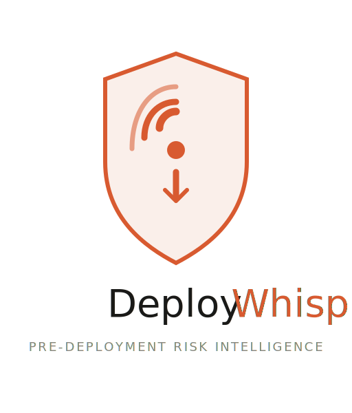
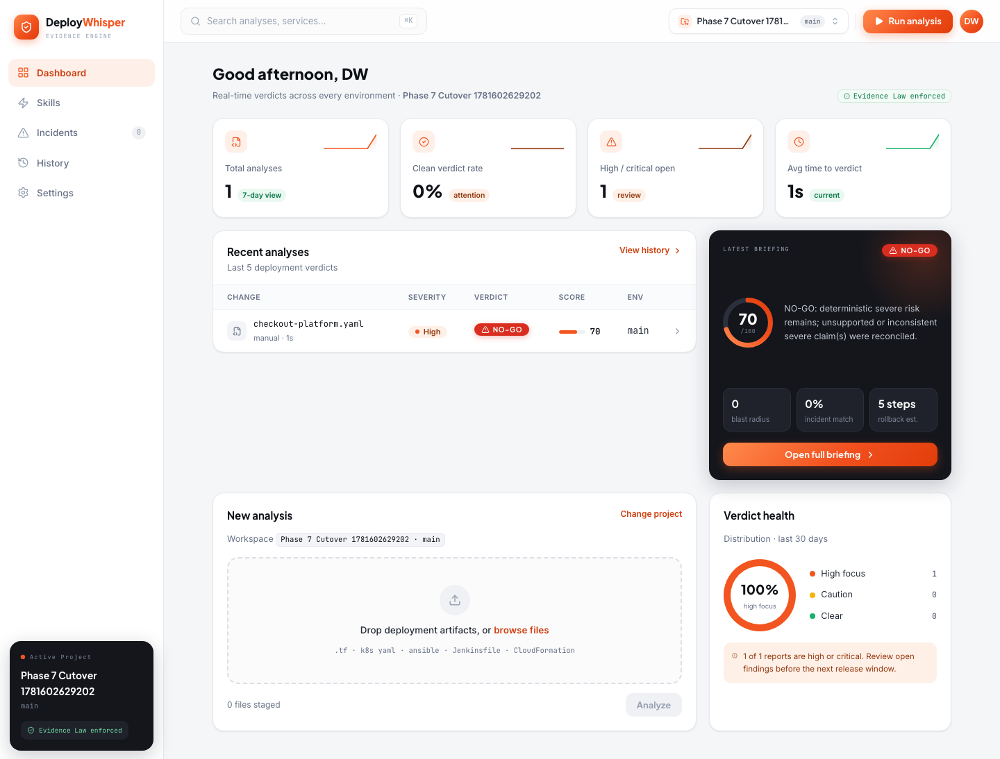
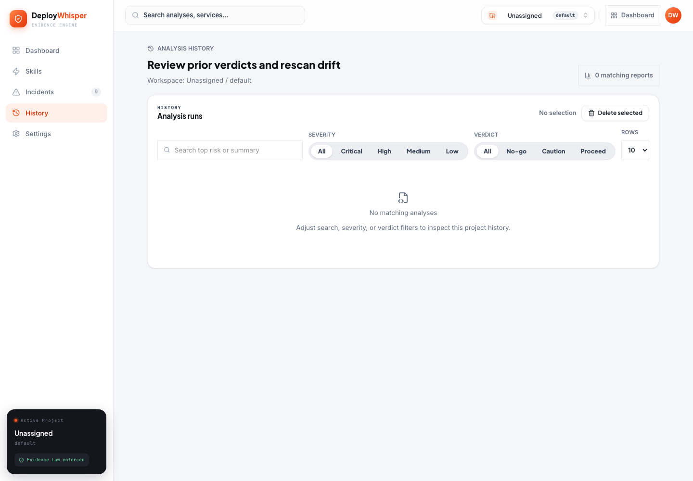
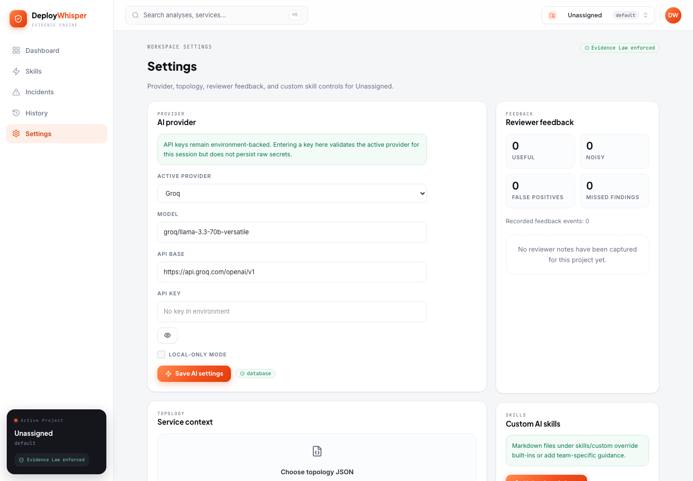

<p align="center">
  
</p>

----

# DeployWhisper

An open-source pre-deployment risk intelligence platform for infrastructure changes.

DeployWhisper helps platform engineers, DevOps teams, and SREs review deployment artifacts before release. It analyzes Terraform, Kubernetes, Ansible, Jenkins, and CloudFormation inputs, then turns those inputs into a single advisory briefing with risk scoring, blast radius context, rollback guidance, and plain-English narrative output.

<p>
  <a href="https://github.com/deploywhisper/deploywhisper/actions/workflows/ci.yml"></a>
  <a href="https://github.com/deploywhisper/deploywhisper/stargazers"></a>
  <a href="https://github.com/deploywhisper/deploywhisper/network/members"></a>
  <a href="https://github.com/deploywhisper/deploywhisper/issues"></a>
  
  
</p>

**Quick links:** [Quick Start](#quick-start) · [Skills Registry](https://deploywhisper.github.io/skills-registry/) · [API Endpoints](#api-endpoints) · [Development](#development) · [Contributing](#contributing) · [Open Source](#open-source)

## Table of Contents

- [Introduction](#introduction)
- [How It Works](#how-it-works)
- [Key Features](#key-features)
- [Screenshots And Demo](#screenshots-and-demo)
- [Current Status](#current-status)
- [Prerequisites](#prerequisites)
- [Quick Start](#quick-start)
- [Docker Deployment](#docker-deployment)
- [API Endpoints](#api-endpoints)
- [CLI Usage](#cli-usage)
- [Configuration](#configuration)
- [Architecture](#architecture)
- [Documentation](#documentation)
- [Development](#development)
- [CI](#ci)
- [Contributing](#contributing)
- [Open Source](#open-source)
- [Roadmap Signals](#roadmap-signals)
- [Status](#status)

## Introduction

DeployWhisper exists because deployment risk is rarely visible in a single file. A Terraform change might look safe on its own, a Kubernetes manifest might look routine on its own, and a Jenkins pipeline change might look minor on its own, but the real risk often appears only when those artifacts are reviewed together.

DeployWhisper treats deployment review as a context problem. It combines multi-tool parsing, local-first analysis, tool-specific AI Skills, incident-memory matching, and advisory summaries so teams can make better go/no-go decisions before changes reach production.

The current implementation is built as a pure-Python application with:

- NiceGUI for the operator-facing web UI
- FastAPI for the versioned API surface
- SQLAlchemy and SQLite for persistence
- Direct SDK adapters for OpenAI, Anthropic, Gemini, and local Ollama narrative generation

## How It Works

1. Upload one or more supported deployment artifacts.
2. DeployWhisper detects the tool type and filters unsupported or sensitive inputs.
3. Parsers normalize changes into a shared internal model.
4. The analysis pipeline scores risk, computes blast radius, generates rollback guidance, and checks incident similarity.
5. A narrative layer produces a plain-English deploy briefing.
6. The report is persisted with audit metadata before it is shown in the UI or returned through the API or CLI.

At a high level:

```text
Artifacts -> Parse -> Normalize -> Score -> Blast Radius -> Rollback -> Narrative -> Advisory Report
```

## Key Features

- Multi-tool intake for Terraform, Kubernetes, Ansible, Jenkins, and CloudFormation
- Plain-English risk narrative and deploy recommendation
- Advisory-only output with explicit human-review posture
- Blast radius analysis using a service-topology file
- Rollback plan generation with complexity signaling
- Incident-history matching for operational memory
- API, CLI, and web entrypoints over one shared analysis pipeline
- Local-first security model that keeps raw IaC local and avoids persisting API keys
- Custom AI Skills for team-specific domain guidance
- Public Skills Registry for published built-in skills: <https://deploywhisper.github.io/skills-registry/>
- Analysis history and audit metadata for later review

## Screenshots And Demo

### UI Screenshot
`Upload flow, risk summary, and advisory result`


`Saved analyses, filters, and audit metadata`
 

`Provider config, topology upload, and custom skills`


<!-- Example future embeds:


-->

## Current Status

DeployWhisper is an open-source project in active development. The current
released version is useful today for teams that want a local-first, advisory
review layer before infrastructure changes are shipped.

### Released version `v1.0.0`

What users can use today:

- **Web review workflow**: upload deployment artifacts in the NiceGUI dashboard and get a persisted advisory report with risk score, severity, recommendation, findings, evidence, context quality, blast radius, rollback guidance, and audit metadata.
- **Multi-tool analysis**: analyze Terraform, Kubernetes, Ansible, Jenkins, and CloudFormation inputs through one shared pipeline instead of reviewing every tool in isolation.
- **LLM-assisted narrative**: connect deterministic scoring with plain-English deployment guidance using Ollama, OpenAI, Anthropic, Gemini, OpenRouter, Groq, or xAI provider settings.
- **Local-first safety posture**: keep raw IaC processing local, avoid storing provider API keys in the database, exclude sensitive files from unsafe handling, and keep every verdict advisory rather than automatically blocking a release.
- **Evidence-backed confidence**: trace the report back to findings, resource-level contributors, uploaded artifact references, parser coverage, topology freshness, and warning signals when context is limited.
- **Blast-radius and rollback context**: use service-topology input to explain likely downstream impact and generate rollback steps with complexity scoring.
- **Analysis history**: review saved reports later, filter previous analyses, inspect audit metadata, and compare repeated scans of the same artifact set.
- **Provider and team settings UI**: configure LLM provider metadata, upload topology context, manage custom AI Skills, and see provider readiness before running analysis.
- **REST API and CLI access**: run the same analysis pipeline from `/api/v1` endpoints or the headless CLI for local automation and CI workflows.
- **Shareable reports**: create read-only report links, optionally protect sensitive shared reports with a password, redact filenames, and compare shared reruns when previous scans exist.
- **Published Skills Registry**: browse published built-in skills at <https://deploywhisper.github.io/skills-registry/> and extend guidance with custom skills.
- **Published GitHub Action path**: use the dedicated `deploywhisper/analyze-action@v1` action to analyze PR artifact changes, post/update an advisory PR comment, and expose report outputs for follow-on workflow steps.
- **Published container path**: run the released container image `ghcr.io/deploywhisper/deploywhisper:1.0.0` with SQLite-backed persistence for a self-hosted single-container setup.
- **Project quality baseline**: GitHub Actions CI, Python quality checks, sharded tests, local CI scripts, and optional UI accessibility smoke checks are in place.

Why this gives users value:

- Platform and DevOps teams get a faster first-pass deployment review before a human approval meeting.
- Engineers can see why a change is risky, which resource/file caused it, what to verify, and what rollback concern to discuss.
- Teams can build trust gradually because reports keep deterministic evidence visible even when LLM narrative is enabled.
- Open-source users can start locally with Docker or Python, then add provider keys, topology context, custom skills, and GitHub PR automation when they are ready.

What is still evolving:

- Production-grade authn/authz for shared deployments
- Richer incident ingestion workflows
- Broader deployment integrations and release automation
- More complete NFR hardening for shared or internet-facing environments

Planning and design artifacts live under [`_bmad-output/planning-artifacts/`](./_bmad-output/planning-artifacts/).

> This README describes the current implementation honestly. Some sections reflect the implemented foundation, while others point to the intended open-source direction captured in the planning artifacts.

## Prerequisites

- Python 3.11 or newer recommended
- A virtual environment for local development
- Optional LLM provider access:
  - Ollama for fully local mode
  - or OpenAI / Anthropic / Gemini / OpenRouter / Groq / xAI credentials via environment variables

Tier-1 providers use direct adapters:

- OpenAI via the official `openai` SDK
- Anthropic via the official `anthropic` SDK
- Gemini via the official `google-genai` SDK
- Ollama via the local HTTP adapter

OpenRouter, Groq, and xAI remain on the compatibility path through one explicit OpenAI-compatible adapter. For local-only narrative generation, Ollama is the intended path.

Provider settings and health surfaces also expose explicit capability metadata for structured output, local-only mode, remote MCP, local MCP, and tool approval. These MCP-related flags are planning metadata only for now; DeployWhisper does not execute MCP tools in the current narrative flow.

## Quick Start

### Local Setup

```bash
python3 -m venv .venv
source .venv/bin/activate
python -m pip install --upgrade pip
pip install -r requirements.txt
python app.py
```

The app starts on:

- UI: `http://127.0.0.1:8080/`
- API docs: `http://127.0.0.1:8080/api/v1/docs`
- Health: `http://127.0.0.1:8080/api/v1/health`

### Local Validation

```bash
./.venv/bin/python -m unittest discover -q
```

Credentialed provider smoke tests are opt-in so the default suite remains offline:

```bash
DEPLOYWHISPER_LIVE_PROVIDER_SMOKE=1 \
  DEPLOYWHISPER_LIVE_PROVIDER_SMOKE_PROVIDERS=openai \
  ./.venv/bin/python -m unittest tests.test_llm.test_live_provider_smoke -q
```

The smoke test loads provider keys from environment variables or `.env` and only
runs providers with usable keys. Provider-specific model and API-base overrides
use `DEPLOYWHISPER_LIVE_<PROVIDER>_MODEL` and
`DEPLOYWHISPER_LIVE_<PROVIDER>_API_BASE`.

## Docker Deployment

DeployWhisper supports a single-container deployment model.

example: Docker compose file `docker-compose.yml`

```bash
services:
  deploywhisper:
    # If you want to use the already published image, uncomment the "image" section and comment out the build section.
    image: ghcr.io/deploywhisper/deploywhisper:1.0.0
    ports:
      - "8080:8080"
    restart: unless-stopped
    init: true
    environment:
      APP_HOST: 0.0.0.0
      APP_PORT: 8080
      APP_BASE_URL: http://localhost:8080
      LOG_LEVEL: INFO
      DATABASE_URL: sqlite:///data/deploywhisper.db
      DEPLOYWHISPER_SHARE_TOKEN: "DEPLOYWHISPER_API_TOKEN-for-test-123"
      LLM_PROVIDER: ollama
      LLM_MODEL: ollama/gemma4:e4b
      LLM_API_BASE: http://host.docker.internal:11434
      LLM_API_KEY: ""
      OPENAI_API_KEY: ""
      ANTHROPIC_API_KEY: ""
      GEMINI_API_KEY: ""
      GOOGLE_API_KEY: ""
      OPENROUTER_API_KEY: ""
      GROQ_API_KEY: ""
      XAI_API_KEY: ""
    volumes:
      - deploywhisper-data:/app/data

volumes:
  deploywhisper-data:
```

after create this file then run:
```bash
docker-compose up -d
```

Default container behavior:

- Port `8080` exposed from the app container
- SQLite database stored under `/app/data`
- Default provider set to Ollama directly in `docker-compose.yml`
- `POST /api/v1/analyses/{id}/share` stays disabled until `DEPLOYWHISPER_SHARE_TOKEN` is set in Compose

Provider settings in the checked-in `docker-compose.yml` are literal container
environment values. The file does not rely on project-root `.env` interpolation.
For machine-specific provider settings, create an untracked
`docker-compose.override.yml` and put only your local overrides there.

Example `docker-compose.override.yml` for OpenAI:

```yaml
services:
  deploywhisper:
    environment:
      LLM_PROVIDER: openai
      LLM_MODEL: gpt-4.1-mini
      LLM_API_BASE: https://api.openai.com/v1
      OPENAI_API_KEY: your-real-key
```

Example override for Groq:

```yaml
services:
  deploywhisper:
    environment:
      LLM_PROVIDER: groq
      LLM_MODEL: groq/qwen/qwen3-32b
      LLM_API_BASE: https://api.groq.com/openai/v1
      GROQ_API_KEY: your-real-key
```

Example override for local Ollama:

```yaml
services:
  deploywhisper:
    environment:
      LLM_PROVIDER: ollama
      LLM_MODEL: ollama/llama3
      LLM_API_BASE: http://host.docker.internal:11434
```

After editing Compose settings, recreate the container:

```bash
docker compose up -d --force-recreate
```

If provider settings were already saved in the DeployWhisper settings page,
those non-secret database settings take precedence over `LLM_PROVIDER`,
`LLM_MODEL`, and `LLM_API_BASE`; API keys still come only from container
environment variables or runtime secrets. When you select a provider in the
settings page, DeployWhisper resolves that provider's environment key
(`GROQ_API_KEY` for Groq, `OPENAI_API_KEY` for OpenAI, or fallback
`LLM_API_KEY`) and pre-fills the API key field from the running container.
Saving the settings page activates the selected provider as the single runtime
provider.

Do not bake secrets into the image. For local Docker Compose, keep secrets in
an untracked `docker-compose.override.yml`; for managed deployments, use your
orchestration platform's secret mechanism.


### For a straightforward ad hoc Docker command

Direct `docker run` example:

```bash
docker run -d \
  -p 8080:8080 \
  -e APP_HOST=0.0.0.0 \
  -e APP_PORT=8080 \
  -e APP_BASE_URL=https://deploywhisper.example.com \
  -e DEPLOYWHISPER_SHARE_TOKEN=replace-with-a-long-random-secret \
  ghcr.io/deploywhisper/deploywhisper:1.0.0
```

## API Endpoints

### Health Check

```http
GET /api/v1/health
```

Response shape:

```json
{
  "data": {
    "status": "ok",
    "mode": "foundation",
    "core_status": "ok",
    "llm": {
      "status": "ok",
      "ready": true,
      "provider": "ollama",
      "model": "ollama/llama3",
      "local_mode": true,
      "requires_api_key": false,
      "has_api_key": false,
      "message": "LLM provider connection validated for analysis.",
      "source": "environment"
    }
  },
  "meta": {
    "app": "DeployWhisper",
    "version": "0.1.0"
  }
}
```

### Create Analysis

```http
POST /api/v1/analyses
```

Upload one or more artifact files as multipart form-data.

Response includes:

- intake summary
- parse batch
- evidence items
- assessment
- narrative availability/failure notice when the LLM path degrades
- advisory summary
- share summary
- persisted report metadata

### List Analyses

```http
GET /api/v1/analyses
```

Supports filtering by:

- `severity`
- `recommendation`
- `search`
- `page`
- `page_size`

### Fetch One Analysis

```http
GET /api/v1/analyses/{report_id}
```

## CLI Usage

DeployWhisper includes a headless CLI entrypoint for local or CI usage.

### Analyze Artifacts

```bash
python cli.py analyze path/to/plan.json path/to/deployment.yaml
```

The CLI prints structured JSON containing:

- intake status
- risk assessment
- advisory summary
- share summary
- persisted report metadata

### Inspect Skill Status

```bash
python cli.py skills
```

This shows built-in and custom skill override status.

## Configuration

DeployWhisper is configured primarily through environment variables and stored non-secret settings.

### Core Runtime Variables

- `APP_NAME`
- `APP_VERSION`
- `APP_HOST`
- `APP_PORT`
- `LOG_LEVEL`
- `DATABASE_URL`
- `TOPOLOGY_PATH`

### LLM Provider Variables

- `LLM_PROVIDER`
- `LLM_MODEL`
- `LLM_API_BASE`
- `LLM_API_KEY`
- `OPENAI_API_KEY`
- `ANTHROPIC_API_KEY`
- `GEMINI_API_KEY`
- `GOOGLE_API_KEY`
- `OPENROUTER_API_KEY`
- `GROQ_API_KEY`
- `XAI_API_KEY`

### Security Model

DeployWhisper is designed so that:

- raw IaC stays local
- sensitive files such as `.env`, `.pem`, `.key`, `id_rsa`, `credentials`, and `*.tfstate` are excluded from unsafe downstream handling
- provider API keys are not stored in the application database
- advisory results remain non-blocking in v1

## Architecture

DeployWhisper uses one shared analysis core with three access surfaces:

- Web UI via NiceGUI
- REST API via FastAPI
- CLI via `cli.py`

Primary runtime components:

- `parsers/`: tool-specific artifact parsing
- `analysis/`: risk scoring, blast radius, rollback, and incident matching
- `services/`: orchestration, persistence, settings, and topology workflows
- `llm/`: provider routing, prompts, skill context, and narrative generation
- `ui/`: dashboard, history, incidents, and settings pages
- `api/`: versioned routes and schema envelopes

Key architectural constraints:

- local-first processing for raw artifacts
- advisory-only decision support in v1
- single-container deployment model
- stable API contract under `/api/v1`
- persisted reports before presentation

For more detail, see [`_bmad-output/planning-artifacts/architecture.md`](./_bmad-output/planning-artifacts/architecture.md).

## Documentation

Project documentation currently lives in a few places:

- [PRD](./_bmad-output/planning-artifacts/prd.md)
- [Architecture](./_bmad-output/planning-artifacts/architecture.md)
- [UX Specification](./_bmad-output/planning-artifacts/ux-design-specification.md)
- [Epics and Stories](./_bmad-output/planning-artifacts/epics.md)
- [Implementation Readiness Report](./_bmad-output/planning-artifacts/implementation-readiness-report-2026-04-20.md)
- [Evidence Model Foundation](./docs/evidence-model.md)
- [CI Guide](./docs/ci.md)
- [CI Secrets Checklist](./docs/ci-secrets-checklist.md)

## Development

### Repository Structure

```text
api/          FastAPI routes and schemas
analysis/     Risk scoring, blast radius, rollback, incident matching
cli/          Headless analysis commands
llm/          Narrative generation and skill context
models/       ORM tables and repositories
parsers/      Tool-specific parsers
services/     Shared orchestration and persistence logic
ui/           NiceGUI routes and components
tests/        API, CLI, parser, service, UI, and infra tests
```

### Common Development Commands

Install dependencies:

```bash
pip install -r requirements.txt
```

Run the app:

```bash
python app.py
```

Run the full test suite:

```bash
./.venv/bin/python -m unittest discover -q
```

Run the local CI-equivalent checks:

```bash
bash scripts/ci-local.sh
```

Run the browser keyboard smoke for the review flow:

```bash
npm install
npm run test:ui-review
```

Run the real macOS VoiceOver smoke on a GUI-enabled Mac:

```bash
npm run setup:ui-review
npm run test:ui-review:voiceover
```

## GitHUb CI

GitHub Actions is configured in [`.github/workflows/ci.yml`](./.github/workflows/ci.yml).

### DeployWhisper Analyze Action

The published GitHub Marketplace action now lives in its own dedicated public
repository:
[`deploywhisper/analyze-action@v1`](https://github.com/deploywhisper/analyze-action).

Typical PR usage:

```yaml
name: DeployWhisper

on:
  pull_request:
    types: [opened, synchronize, reopened]

permissions:
  contents: read
  pull-requests: write

jobs:
  deploywhisper:
    runs-on: ubuntu-latest
    steps:
      - uses: actions/checkout@v4
        with:
          fetch-depth: 0
      - uses: deploywhisper/analyze-action@v1
        with:
          api-url: ${{ secrets.DEPLOYWHISPER_API_URL }}
```

What the action does:

- detects changed files from the pull request diff
- filters to supported DeployWhisper artifacts locally before upload
- submits those artifacts to the existing `POST /api/v1/analyses` endpoint
- posts a single markdown PR comment and updates that same comment on re-runs
- compares the latest report with the previous PR scan so reruns show score and severity deltas in the refreshed comment
- exits `0` when analysis succeeds, regardless of risk verdict
- exposes outputs for follow-on GitHub steps:
  - `report-id`
  - `report-link` (shareable `/reports/{id}` URL)
  - `severity`
  - `recommendation`
  - `share-summary-json`
  - `share-summary-markdown`
  - `comment-id`
  - `comment-url`
  - `comment-updated`

Optional inputs:

- `api-token`: bearer token for protected DeployWhisper APIs
- `changed-files`: override auto-detected PR files with a comma or newline separated list
- `working-directory`: repository root when the checkout is not in `.`

Shared report links now resolve to `/reports/{id}` read-only pages. For sensitive
reports, configure password protection and opt-in file-name redaction via
`POST /api/v1/analyses/{id}/share` with the `X-DeployWhisper-Share-Token`
header. Set `DEPLOYWHISPER_SHARE_TOKEN` before exposing that management API.
When a prior scan exists for the same analyzed artifact set, the shared report
page also exposes a `Compare with previous` view with risk-score, findings, and
evidence deltas.

### GitHub App Mode

DeployWhisper also supports a GitHub App adapter for webhook-driven PR analysis,
checks API publishing, and OAuth-guided installation handoff. The App adapter is
documented in [`docs/github-app.md`](./docs/github-app.md) and is designed to
run in three lanes:

- Action-first: workflow file + Marketplace Action
- Advanced self-hosted GitHub App: webhook, checks, and OAuth-backed installation flow against your own DeployWhisper server
- Combined mode: Action for explicit workflow control, self-hosted GitHub App for checks and richer installation UX

The recommended open-source posture is Action-first. If you want GitHub App
capabilities, create a private/self-hosted GitHub App in your own account or
organization and point it at your own DeployWhisper instance. See
[`docs/github-app-self-hosted-setup.md`](./docs/github-app-self-hosted-setup.md).
Keep the `DeployWhisper / Risk Analysis` check advisory-only in GitHub branch
protection; do not add it as a required status check.

To scaffold this setup into another repository with a workflow file, README
update, and optional self-hosted GitHub App notes, run:

```bash
deploywhisper github init
```

Example:

```bash
curl -X POST http://127.0.0.1:8080/api/v1/analyses/17/share \
  -H "Content-Type: application/json" \
  -H "X-DeployWhisper-Share-Token: $DEPLOYWHISPER_SHARE_TOKEN" \
  -d '{"password":"review-only","redact_filenames":true}'
```

The app repository no longer carries Marketplace action packaging files. Action
source, release metadata, and consumer smoke verification live in the dedicated
`deploywhisper/analyze-action` repository.

Current CI stages:

- `quality`
- `changed-tests`
- `test`
- `report`
- `notify-failure`

The CI pipeline is backend-focused and intentionally skips frontend-style burn-in loops because the current stack is Python `unittest`, not a flaky browser E2E suite.

For accessibility-sensitive UI changes, the repo also ships an opt-in macOS verification lane:

- `npm run test:ui-review` exercises the seeded review flow with Playwright keyboard automation.
- `npm run test:ui-review:voiceover` exercises the same flow with real VoiceOver on macOS after `npm run setup:ui-review`.
- `RUN_UI_A11Y=1 bash scripts/ci-local.sh` appends both lanes locally when Node dependencies are installed. The VoiceOver step auto-skips on non-macOS hosts.

## Contributing

Contributions are welcome.

If you want to contribute:

1. Fork the repository
2. Create a feature branch
3. Run the local test suite
4. Open a pull request with clear rationale and verification notes

High-value contribution areas:

- parser coverage and fixture quality
- risk scoring improvements
- incident-ingestion workflows
- topology-management UX
- authn/authz hardening
- documentation and examples

### Good First Contributions

- Improve README examples for CLI and API usage
- Add realistic parser fixtures for one supported tool
- Strengthen docs around topology JSON and custom skill uploads
- Add screenshots or a short demo GIF once the UI flow is stable
- Expand CI or test coverage around one isolated service or route

### Pull Request Expectations

- Keep changes scoped and reviewable
- Include verification notes
- Avoid checking in secrets, real infrastructure state, or sensitive sample files
- Prefer tests for behavior changes
- Prefer docs updates when behavior or setup changes

### Reporting Bugs Or Requesting Features

Use GitHub Issues for:

- bug reports
- parser edge cases
- feature requests
- documentation gaps
- architecture or API discussions before larger implementation work

For larger proposals, open an issue first so the implementation direction is discussed before code starts to drift.

## Open Source

DeployWhisper is being developed as an open-source project for DevOps and platform engineering teams.

The intended open-source value proposition is:

- transparent local-first deployment review
- self-hostable architecture
- extensible AI Skills model
- advisory-first automation for CI/CD workflows

If you adopt or extend the project, keep the current maturity in mind: the core analysis path exists, but some production-hardening work is still in progress.

### Open-Source Project Shape

The repository is best understood as:

- a working implementation foundation
- an evolving open-source DevOps tool
- a planning-backed project with explicit product and architecture artifacts

That means contributors can help in both code and product-facing areas:

- implementation
- tests
- docs
- examples
- UX captures
- integration ideas

### Community-Friendly Improvements Still Needed

- real screenshots and demo media
- more sample artifacts for supported tools
- contributor-facing repo metadata such as `LICENSE`, `CONTRIBUTING.md`, `CODE_OF_CONDUCT.md`, and `SECURITY.md`
- broader onboarding docs for first-time contributors

## Roadmap Signals

Near-term directions already visible in the repo and planning artifacts:

- stronger production hardening around auth, observability, and recovery
- richer CI/CD integration patterns
- more complete incident-ingestion and trend workflows
- better contribution and onboarding surfaces for open-source users

## Status as we’re in full swing

### DeployWhisper is under active development, while release `v1.0.0` is stable.

Current implementation state:

- foundation scaffold done.
- shared analysis pipeline is implemented
- API, UI, and CLI surfaces exist
- CI is in place
- broader production hardening is still underway


This repository should be treated as an evolving open-source platform project rather than a fully hardened production product.
