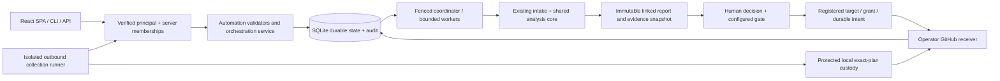

# DeployWhisper Architecture Document

**Product:** DeployWhisper  
**Document type:** Architecture Decision and Target-State Design  
**Version:** 2.1 - v1.5.0 Infrastructure Automation Planning Amendment
**Date:** 2026-10-07
**Owner:** Pramod Kumar Sahoo  
**Primary source:** `_bmad-output/planning-artifacts/prd.md`; v1.5.0 course correction and feature release plan
**Amendment status:** Planning scope authorized 2026-10-07; Section 25 target design requires RFC review and Story 16.0 feasibility evidence before implementation readiness. Existing sections describe the prior baseline/roadmap, not delivery proof for Epic 16.

---

## 1. Purpose

This architecture defines how DeployWhisper evolves into the self-hosted, fully open-source safety layer for human-written and AI-generated infrastructure changes before production.

The design aligns with the finalized PRD and intentionally preserves the strongest parts of the current implementation:

- Python-first application stack.
- FastAPI runtime serving a static React SPA plus versioned API routes.
- API, CLI, UI, and workflow integrations over one analysis core.
- Local-first raw artifact boundary.
- Advisory-first output.
- SQLite-backed self-hosted baseline with a PostgreSQL path for shared/team installs.
- Direct provider adapters behind a DeployWhisper-owned provider boundary.
- Deterministic analysis before narrative generation.

This document is the bridge between the finalized PRD and implementable epics/stories. It replaces the older six-epic architecture direction with the expanded roadmap. Section 25 integrates the highest-priority v1.5.0 feature, Epic 16, without rewriting delivered story IDs or changing the analysis core.

---

## 2. Non-Negotiable Product Constraints

The following constraints shape every architectural decision.

1. **Fully open-source:** No open-core split, paid enterprise-only feature set, proprietary required plugin, or closed benchmark dataset.
2. **Self-hosted only:** No DeployWhisper-hosted SaaS product, hosted API, hosted dashboard, hosted model service, or vendor-managed control plane.
3. **Local-first raw artifact boundary:** Raw IaC, scanner artifacts, incident exports, and sensitive context stay in the user's infrastructure by default.
4. **Evidence Law:** No high or critical finding without deterministic evidence.
5. **Advisory-first core:** The core produces evidence-backed recommendations; enforcement can only happen through explicitly configured adapters.
6. **One shared analysis core:** UI, API, CLI, GitHub, CI/CD, MCP/agent, and future integrations must call the same orchestration pipeline.
7. **Documentation as product:** User-facing, operator-facing, API-facing, integration-facing, and contributor-facing changes are incomplete without documentation.
8. **Community and CNCF readiness:** Governance, maintainership, security, release, benchmark, and contribution paths are first-class product surfaces.

---

## 3. Architecture Goals

DeployWhisper must support these product goals:

1. Produce a defensible deployment briefing from deterministic evidence, not generic AI prose.
2. Make project, workspace, and environment scope explicit before reports, incidents, topology, feedback, and connectors harden.
3. Provide day-zero value through public risk patterns before organization-specific incident history exists.
4. Work alongside existing security tools by ingesting scanner output as external evidence without blindly inheriting scanner severity.
5. Support human reviewers and AI coding agents through stable machine-readable report outputs.
6. Preserve local-first operation while allowing user-owned optional integrations.
7. Publish benchmark and honest failure evidence so trust claims are measurable.
8. Enable community extension through Skills, parsers, connectors, risk patterns, benchmark scenarios, and documentation.
9. Offer a migration path from local SQLite usage to shared self-hosted operation without introducing hosted-control-plane assumptions.

---

## 4. Architectural Principles

### 4.1 Evidence first

Every material risk claim must trace to one or more evidence items. Evidence items must identify artifact, location, resource, operation, project/workspace scope, and context source when available.

### 4.2 Evidence Law enforcement in code

High and critical findings require deterministic evidence. This is not copy, UX guidance, or a soft convention; it must be enforced in schema validation, tests, report generation, PR output, API output, CLI output, and benchmark checks.

### 4.3 One analysis core

All delivery surfaces call the same orchestration path:

```text
intake -> classify -> parse -> evidence -> context -> score -> explain -> persist -> deliver
```

No UI, CLI, API, GitHub Action, GitHub App, MCP, or policy adapter may reimplement scoring, evidence rules, or severity logic.

### 4.4 Advisory by default, adapter enforcement by exception

DeployWhisper's canonical report is advisory. Optional policy, CI, or approval adapters may translate report output into warnings, soft blocks, or hard blocks only when explicitly configured.

### 4.5 Local-first and least-disclosure

Raw artifacts and sensitive context stay local. External model calls, when enabled, receive structured summaries rather than raw uploaded artifacts.

### 4.6 Uncertainty is output

Missing topology, stale context, partial parsing, external scanner conflicts, low match confidence, or degraded narrative are not hidden. They must become report fields, UI states, CLI messages, API fields, and benchmark signals.

### 4.7 Baseline before expansion

Existing working capabilities are preserved and extended. The architecture does not require a rewrite to reach the next phase.

### 4.8 Documentation and tests travel with architecture

Every new boundary, schema, adapter, connector, integration, and report contract needs tests and docs in the same delivery stream.

---

## 5. Current Baseline

The current repository already provides meaningful implementation foundation:

- `app.py` composes FastAPI routes, OpenAPI docs, the static React SPA mount, legacy route redirects, and database startup.
- `api/` exposes versioned `/api/v1` routes and schema contracts.
- `cli/` exposes headless analysis and related commands.
- `services/analysis_service.py` orchestrates the shared analysis flow.
- `services/intake_service.py` handles upload classification, unsupported inputs, and sensitive-file behavior.
- `parsers/` normalizes Terraform, Kubernetes, Ansible, Jenkins, and CloudFormation inputs.
- `analysis/` provides risk scoring, blast radius, interaction risk, rollback, and incident matching.
- `evidence/` provides the emerging evidence-oriented boundary.
- `llm/` provides provider resolution, direct SDK adapters, compatibility adapters, prompts, and narrative generation.
- `models/` and `models/repositories/` provide SQLAlchemy tables and persistence access.
- `frontend/` provides the React 18 + Vite + TypeScript SPA workspace, built into static assets served at `/`.
- `integrations/github/` and `api/routes/github_app.py` provide the GitHub integration foundation.
- `services/project_service.py`, `services/feedback_service.py`, `services/deployment_outcome_service.py`, and `services/backtesting_service.py` show that project, feedback, outcome, and backtesting concepts are already emerging in code.
- `services/skill_*` and `tests/skill-tests/` provide marketplace and Skill validation foundation.
- `docs/` already contains substantial product, integration, evidence, GitHub, project/workspace, and Skills documentation.

The architecture should extend this baseline, not rebuild it.

---

## 6. Target System Context

### 6.1 Actors

- Platform engineer running pre-deploy review.
- SRE or production approver making go/no-go decisions.
- Security/AppSec reviewer interpreting scanner findings in deployment context.
- Platform admin maintaining projects, workspaces, topology, incidents, connectors, provider settings, and Skills.
- Junior engineer learning from evidence-backed explanations.
- Engineering manager reviewing history, outcomes, trends, and benchmark evidence.
- AI coding agent requesting machine-readable review.
- Skill, parser, connector, benchmark, and documentation contributor.
- Maintainer or CNCF reviewer evaluating project health.

### 6.2 External systems

All external systems are user-owned or community-owned integrations, not DeployWhisper-operated services:

- GitHub, GitLab, Jenkins, Atlantis, HCP Terraform, Argo CD, Flux, and other workflow systems.
- Local Ollama and user-configured external model providers.
- Incident systems or exports such as Markdown, YAML, JSON, PagerDuty, Opsgenie, Jira, GitHub Issues, and Slack exports.
- External scanner outputs such as SARIF and scanner-specific JSON.
- Terraform/OpenTofu state, Kubernetes manifests/live-state, CODEOWNERS, service catalogs, and ownership maps.
- Public Skills registry repository and private organization Skill sources.
- Public benchmark corpus and benchmark report artifacts.
- Open-source supply-chain systems such as OpenSSF Scorecard, CodeQL, SBOM, signing, and provenance workflows.

---

## 7. High-Level Component Architecture

```text
                         +-----------------------------+
                         |  Human Review Surfaces      |
                         |  UI / CLI / API / PR output |
                         +--------------+--------------+
                                        |
                         +--------------v--------------+
                         |  Delivery Adapter Layer     |
                         | GitHub / CI / MCP / Policy  |
                         +--------------+--------------+
                                        |
                         +--------------v--------------+
                         | Shared Analysis Orchestrator|
                         +--------------+--------------+
                                        |
       +--------------------------------+--------------------------------+
       |                                |                                |
+------v------+                 +-------v-------+                +-------v-------+
| Intake &    |                 | Evidence &    |                | Context &     |
| Parser      |                 | Risk Core     |                | Memory        |
| Registry    |                 |               |                |               |
+------+------+                 +-------+-------+                +-------+-------+
       |                                |                                |
       +--------------------------------+--------------------------------+
                                        |
                         +--------------v--------------+
                         | Report Contract & Storage   |
                         +--------------+--------------+
                                        |
       +--------------------------------+--------------------------------+
       |                                |                                |
+------v------+                 +-------v-------+                +-------v-------+
| Skills &    |                 | Benchmarks &  |                | Governance,   |
| Extensions  |                 | Backtesting   |                | Docs, Supply  |
|             |                 |               |                | Chain         |
+-------------+                 +---------------+                +---------------+
```

### 7.1 Access layer

Responsible for accepting requests and presenting results:

- React SPA at `/`, served as static files by FastAPI with client-route fallback.
- Legacy pre-cutover SPA links and old report-detail links redirect to their root React equivalents.
- FastAPI `/api/v1` routes.
- CLI command surface.
- GitHub Action and GitHub App integration.
- Future GitLab, Jenkins, Atlantis, Argo CD, Flux, chat, and MCP/agent surfaces.

Architectural rule:

- Access surfaces adapt input/output only. They do not score, infer severity, enforce Evidence Law, or generate independent report semantics.

### 7.2 Delivery adapter layer

Responsible for workflow-specific formatting and optional enforcement translation:

- PR comment formatter.
- GitHub Checks/status publisher.
- Machine-friendly summaries.
- Report links and report diffs.
- Policy adapter output contract.
- MCP or equivalent agent-callable interface.

Architectural rule:

- Adapters consume canonical report objects. They do not mutate canonical findings or escalate severities.

### 7.3 Shared analysis orchestrator

Responsible for the canonical pipeline:

```text
artifact bundle
-> submission manifest
-> parser outputs
-> evidence items
-> context snapshot
-> findings
-> risk assessment
-> narrative summary
-> persisted report
-> delivery payloads
```

Architectural rule:

- Narrative generation always runs after deterministic evidence and scoring.

### 7.4 Intelligence layer

Responsible for deterministic and derived intelligence:

- Parser registry.
- Evidence extraction.
- Cross-tool interaction analysis.
- Risk scoring.
- Blast radius.
- Rollback readiness and complexity.
- Incident and public risk-pattern matching.
- External scanner contextualization.
- Confidence and uncertainty ledger.
- Why-not-lower / why-not-higher explanation support.

### 7.5 Context and memory layer

Responsible for project-scoped context:

- Project/workspace/environment model.
- Topology sources and freshness.
- Ownership and CODEOWNERS mapping.
- Incident memory.
- Public risk pattern memory.
- Deployment outcomes.
- Reviewer feedback.
- Trend and calibration data.
- Context TODO generation.

### 7.6 Ecosystem layer

Responsible for open contribution surfaces:

- Skills registry.
- Skill manifest and trust levels.
- Skill test harness.
- Skill installer and browser.
- Parser/plugin contribution paths where supported.
- Benchmark corpus and scenario contribution.
- Public risk pattern contribution.
- Documentation and RFC workflows.

### 7.7 Persistence layer

Responsible for durable self-hosted state:

- Reports and report artifacts.
- Evidence items.
- Findings and report schema version.
- Projects and workspaces.
- Topology/context snapshots.
- Incidents and public risk patterns.
- Deployment outcomes and feedback.
- Scanner imports.
- Benchmark runs and results.
- Settings and provider metadata.

SQLite remains valid for local and small single-node installs. PostgreSQL is the target path for shared/team installs and higher concurrency.

---

## 8. Canonical Analysis Pipeline

The canonical pipeline is:

```text
1. Intake
2. Classification
3. Sensitive-file and unsupported-artifact handling
4. Parsing and normalization
5. Evidence extraction
6. Context enrichment
7. Public risk-pattern and incident matching
8. External scanner contextualization
9. Risk scoring and Evidence Law validation
10. Confidence, uncertainty, and context TODO generation
11. Narrative generation from structured summaries
12. Report persistence
13. Surface-specific delivery formatting
```

### 8.1 Intake

The intake layer accepts one or more artifacts and produces a submission manifest containing:

- Accepted artifacts.
- Excluded artifacts.
- Unsupported artifacts.
- Sensitive-file blocks.
- Partial parse status.
- Artifact provenance and redaction status.
- Project/workspace key or derived default.

### 8.2 Parsing and normalization

Parsers normalize supported toolchains into a shared internal change model. Supported and planned toolchains include:

- Terraform and OpenTofu.
- Terraform plan JSON.
- Kubernetes.
- Helm.
- Kustomize.
- Ansible.
- Jenkins.
- CloudFormation.
- CI/CD pipeline definitions.
- Future community-supported toolchains.

Parser failures should produce explicit partial-analysis output, not silent success or hard failure unless no useful analysis can be produced.

### 8.3 Evidence extraction

Evidence extraction turns normalized changes and context sources into first-class evidence items. Evidence items are the required substrate for findings.

Evidence item fields should include:

- Evidence ID.
- Evidence type.
- Source kind.
- Artifact reference.
- Location or path.
- Resource identifier.
- Operation/change type.
- Determinism level.
- Project/workspace/environment scope.
- Context source reference.
- Redaction status.
- Confidence contribution.

### 8.4 Context enrichment

Context enrichment attaches deployment context to evidence and findings:

- Project/workspace/environment.
- Service ownership.
- Topology and dependency graph.
- Topology freshness.
- Environment criticality.
- Deployment history.
- Incident memory.
- Public risk patterns.
- External scanner output.
- Context completeness and TODOs.

### 8.5 Risk scoring

Risk scoring produces:

- Overall advisory verdict.
- Severity.
- Findings.
- Contributors.
- Confidence ledger.
- Why-not-lower and why-not-higher explanations.
- Insufficient-context verdict where needed.
- Evidence Law status.

High and critical findings must fail validation if no deterministic evidence is present.

### 8.6 Narrative generation

Narrative generation consumes a structured report summary after scoring. It may:

- Explain risk.
- Summarize evidence.
- Suggest verification steps.
- Improve readability.
- Help junior reviewers learn from the report.

It must not:

- Create new high or critical findings.
- Override deterministic severity.
- Hide missing context.
- Require raw IaC to leave the local boundary.
- Block deterministic report delivery if it fails.

### 8.7 Persistence before success

Report persistence must happen before returning final success through UI, API, CLI, or integration outputs.

---

## 9. Core Domain Model

### 9.1 Instance

The self-hosted DeployWhisper installation. Owns global configuration, provider settings, optional system-wide connectors, and maintainer/operator settings.

### 9.2 Project

A logical product, repository, platform area, or service group. Reports, topology, incidents, scanner imports, outcomes, feedback, and settings must be project-scoped unless intentionally global.

### 9.3 Workspace or environment

A project sub-scope such as production, staging, Terraform workspace, Kubernetes cluster, account, namespace, or environment.

### 9.4 ArtifactBundle

A single analysis submission containing one or more uploaded or integration-provided artifacts plus manifest metadata.

### 9.5 ArtifactRecord

Metadata for one artifact, including source, type, parse status, sensitive-file status, redaction status, and project/workspace scope.

### 9.6 NormalizedChange

Parser-level representation of infrastructure change before evidence extraction.

### 9.7 EvidenceItem

Inspectable proof used to support findings, context, confidence, and benchmark replay.

### 9.8 Finding

Evidence-backed claim about deployment risk. Findings include severity, category, deterministic/inferred/external classification, evidence references, explanation, remediation or verification guidance, confidence, and Evidence Law status.

### 9.9 RiskAssessment

The scored deployment-risk object containing verdict, severity, findings, contributors, confidence, uncertainty, context completeness, why-not-lower/higher explanations, and advisory recommendation.

### 9.10 ContextSnapshot

Point-in-time context attached to a report, including topology, ownership, freshness, connector status, project/workspace scope, incidents, scanner imports, and context TODOs.

### 9.11 PublicRiskPattern

Built-in or community-contributed known risk pattern that gives fresh installs day-zero memory.

### 9.12 IncidentRecord

Organization-specific incident memory record with root cause, trigger change, affected services, rollback path, prevention notes, match signals, and permission/scope metadata.

### 9.13 ExternalScannerFinding

Scanner-provided evidence imported from SARIF or scanner-specific output. It is labeled as external evidence and cannot automatically become a high/critical DeployWhisper finding without DeployWhisper evidence and scoring.

### 9.14 DeploymentOutcome

Post-deployment result linked to a report, project, workspace, and optional incident. Used for calibration, false-positive tracking, and false-reassurance tracking.

### 9.15 FeedbackEvent

Reviewer feedback on report, finding, confidence, correctness, false-positive, false-negative, or usefulness.

### 9.16 Skill

Markdown-based guidance package with manifest metadata, trust level, test scenarios, supported toolchain/context, and version.

### 9.17 BenchmarkScenario

Public or private replayable scenario with artifacts, expected findings, expected evidence, expected verdict rationale, and labels.

### 9.18 BenchmarkRun

Execution record comparing DeployWhisper output against benchmark scenarios and optional reproducible baselines.

### 9.19 Report

The canonical persisted output. Reports must include schema version, project/workspace scope, evidence, findings, assessment, context, narrative status, delivery payload summaries, and audit metadata.

---

## 10. Service Architecture

### 10.1 Intake Service

Owns artifact validation, sensitive-file handling, unsupported-artifact handling, submission manifest creation, aggregate size checks, and artifact provenance.

### 10.2 Project Service

Owns project/workspace creation, derived project keys, scope lookup, and project-aware defaults.

### 10.3 Parser Registry

Owns tool detection and parser dispatch. Parsers stay isolated by toolchain and return normalized changes plus parse status.

### 10.4 Evidence Service

Owns evidence-item extraction, evidence classification, evidence-to-finding linkage, deterministic/inferred/external labels, and Evidence Law validation support.

### 10.5 Context Service

Owns topology, ownership, freshness, connector state, context completeness, context TODOs, and context snapshot generation.

### 10.6 Risk Engine

Owns severity, verdict, contributors, cross-tool interaction risk, confidence ledger, why-not-lower/higher, insufficient-context verdicts, and Evidence Law gate enforcement.

### 10.7 Public Risk Pattern Service

Owns built-in risk pattern matching and community-contributed risk pattern loading.

### 10.8 Incident Service

Owns organization-specific incident ingestion, indexing, similarity matching, match explanation, and incident scope.

### 10.9 External Scanner Service

Owns SARIF and scanner-specific ingestion, normalization into external evidence, scanner conflict handling, and report/API/PR representation.

### 10.10 Narrator Service

Owns provider selection, structured summary generation, prompt construction, response parsing, degraded fallback, and provider audit metadata.

### 10.11 Report Service

Owns report persistence, retrieval, sharing, comparison, schema versioning, redaction, and audit metadata.

### 10.12 Feedback and Outcome Services

Own reviewer feedback, deployment outcomes, false-positive tracking, false-reassurance tracking, calibration inputs, and learning reports.

### 10.13 Integration Service

Owns GitHub, CI/CD, PR comments, check runs, rerun-on-commit behavior, report links, machine-friendly outputs, and future workflow adapters.

### 10.14 Agent Interface Service

Owns `--agent-json`, MCP or equivalent agent-callable interfaces, prompt-injection protections, advisory-only agent guardrails, and stable machine-readable output.

### 10.15 Skills Services

Own registry, manifest validation, trust levels, install/update/remove, analytics, test harness, browser metadata, and contribution workflow outputs.

### 10.16 Benchmark and Backtesting Services

Own corpus execution, benchmark results, comparative baselines, incident backtesting, regression tracking, latency metrics, and honest failure reporting.

### 10.17 Governance and Documentation Support

Not a runtime service, but an architecture-owned delivery area covering docs generation/checking, RFCs, release process, maintainer ownership, CODEOWNERS, OpenSSF Scorecard, SBOM, signing, provenance, and CNCF readiness artifacts.

---

## 11. Interface Architecture

### 11.1 Web UI

After the Phase 7 UI cutover, the React SPA is the only web UI. It is built
from `frontend/` and served by FastAPI from `frontend/dist` at `/`, with an SPA
fallback so client-side routes survive refresh. Legacy pre-cutover coexistence
links redirect to the corresponding root routes.

The target reviewer workflow remains:

- Project/workspace selection.
- Upload and analysis progress.
- Verdict-first report.
- Evidence Law status.
- Confidence ledger.
- Findings table with evidence inspection.
- Context completeness and TODOs.
- Blast radius and topology freshness.
- Rollback guidance.
- Public risk patterns and incident memory.
- External scanner context.
- Report diff.
- History, trends, outcomes, and feedback.
- Settings for provider, topology, incidents, scanner imports, Skills, and projects.

UX rules:

- Verdict is always above the fold.
- Uncertainty is visible.
- Evidence is inspectable on demand.
- The UI remains advisory and never implies autonomous approval.

### 11.2 REST API

The API remains versioned under `/api/v1` and should expose:

- Project/workspace management.
- Analysis submission and retrieval.
- Report detail and report comparison.
- Evidence and findings.
- Incidents and public risk patterns.
- External scanner import.
- Deployment outcomes and feedback.
- Skills registry and Skill validation.
- GitHub App and integration routes.
- Health/readiness including provider and degraded-mode state.

API rules:

- Use Pydantic response models.
- Preserve stable schema versions.
- Return explicit partial-analysis and degraded-mode fields.
- Include project/workspace scope in report and context objects.

### 11.3 CLI

The CLI must call the same analysis core and support:

- File and directory analysis.
- Project/workspace key input.
- JSON output.
- `--agent-json` output.
- CI-friendly advisory summary.
- Scanner import where practical.
- Backtesting and benchmark commands where appropriate.
- Local-only mode and provider status.

CLI rules:

- CLI output must show Evidence Law status.
- CLI output must remain advisory unless an explicitly configured adapter maps results to exit codes.

### 11.4 GitHub integration

The GitHub path has two complementary surfaces:

- GitHub Action for immediate CI/PR adoption.
- GitHub App for richer installation, PR interaction, checks, and rerun workflows.

Architecture rules:

- Action runtime/package lives in the external `deploywhisper/analyze-action` repository. This app repo documents and integrates with that action; it must not host the Marketplace action runtime.
- PR comments use the canonical report summary.
- Check runs consume report output and configured adapter policy.
- Rerun-on-commit compares the new report against the previous report for the same PR/context.
- GitHub repository flows may derive default project keys from repository name.

### 11.5 Agent and MCP interface

Agent-facing output must be stable, bounded, and advisory:

- Machine-readable report contract.
- Evidence references.
- Confidence and uncertainty.
- Context TODOs.
- Recommended verification steps.
- Explicit "not approval" field.
- Prompt-injection-safe handling of comments, scanner text, incident text, and documentation-like inputs.

Agents must not be able to use DeployWhisper to autonomously approve, deploy, or remediate production changes.

### 11.6 Policy adapter interface

Policy adapters consume canonical report outputs and produce optional enforcement interpretation:

- Advisory only.
- Warn.
- Soft block.
- Hard block.

Hard or soft blocking must be explicitly configured by the user. The core report stays advisory.

---

## 12. Persistence Architecture

### 12.1 Storage baseline

SQLite remains the default for local, single-node, and evaluation installs. The database lives under `data/` by default and is suitable for the current self-hosted baseline.

### 12.2 Shared install path

PostgreSQL is the target path for shared/team installs requiring higher concurrency, stronger backup/restore, and clearer operational boundaries.

### 12.3 Persistence entities

The persistence model should cover:

- Projects and workspaces.
- Reports and report artifacts.
- Artifact records and submission manifests.
- Evidence items.
- Findings.
- Context snapshots.
- Topology sources and freshness.
- Public risk patterns.
- Incident records.
- External scanner imports.
- Deployment outcomes.
- Feedback events.
- Skills, manifests, trust levels, and analytics.
- Benchmark scenarios, benchmark runs, and benchmark results.
- Settings and provider metadata.

### 12.4 Schema evolution

Schema migration uses Alembic. Report schema evolution must also be explicit and visible:

- `report_schema_version` persisted with reports.
- Schema docs under `docs/schemas/`.
- Backward-compatible API behavior where practical.
- Migration notes for user-visible changes.

---

## 13. Security and Privacy Architecture

### 13.1 Raw-local boundary

Raw IaC and sensitive artifacts remain local by default. External LLM calls receive structured summaries, not raw uploads.

### 13.2 Secret handling

Provider credentials and connector credentials must be environment-backed or otherwise handled through explicit secure configuration. They must not be persisted unsafely in the database, logs, prompts, reports, or telemetry.

### 13.3 Prompt-injection controls

Treat these inputs as untrusted:

- IaC comments.
- PR comments.
- Incident text.
- Scanner output.
- Documentation-like artifacts.
- Skill content.

Prompt-injection tests are required for agent and narrative flows.

### 13.4 Project and RBAC boundary

Project/workspace/RBAC boundaries must prevent cross-project leakage in reports, incidents, scanner imports, outcomes, feedback, topology, and connector credentials.

Early implementation may use lightweight project records before full authn/authz, but data models and APIs must not assume a single unscoped universe.

### 13.5 External scanner trust boundary

Scanner output is external evidence. It must be labeled and conflict-aware:

- Scanner findings do not automatically become DeployWhisper findings.
- Scanner severity does not automatically map to DeployWhisper high/critical severity.
- Conflicts between scanner output and deterministic evidence are surfaced.
- Scanner evidence can contribute to context and confidence only through explicit scoring rules.

### 13.6 Skill trust boundary

Skills are markdown guidance, not executable plugins. They can influence narrative and heuristics only through controlled loading, manifest validation, trust levels, and tests.

### 13.7 Supply-chain posture

The project should support:

- Security policy.
- CodeQL.
- Dependency update workflow.
- OpenSSF Scorecard.
- SBOM generation.
- Release signing and provenance.
- Attestations.
- Release process documentation.
- Air-gapped installation guidance.

---

## 14. Deployment Architecture

### 14.1 Supported deployment paths

DeployWhisper is self-hosted. Supported paths:

- Local Python development install.
- Local CLI-first install.
- Single-container Docker install.
- Docker Compose install.
- Kubernetes/Helm install.
- Air-gapped or restricted-network install.
- Self-hosted CI/CD runner integration.

### 14.2 Not supported by product direction

The architecture must not assume or require:

- DeployWhisper-hosted SaaS.
- DeployWhisper-hosted API.
- DeployWhisper-hosted dashboard.
- DeployWhisper-hosted model service.
- Vendor-managed control plane.
- Proprietary telemetry.
- Account registration with DeployWhisper.

### 14.3 Scaling path

The scaling path is:

1. Single-process FastAPI + React SPA + SQLite.
2. Containerized single-node runtime with persistent volume.
3. Docker Compose shared runtime.
4. Kubernetes/Helm self-hosted runtime.
5. PostgreSQL-backed shared runtime.
6. Optional async worker path for expensive connectors, benchmark runs, and integration processing.

Async workers are a future path. The core architecture should keep orchestration boundaries clean enough to add workers without changing report contracts.

---

## 15. Skills Ecosystem Architecture

Skills scale DeployWhisper's domain knowledge without requiring core code changes for every risk pattern or tool nuance.

### 15.1 Skill package

A Skill is a markdown-based package with:

- Manifest metadata.
- Toolchain/context tags.
- Trigger metadata.
- Version.
- Trust level.
- Test scenarios.
- Documentation.

### 15.2 Trust levels

Skill trust levels:

- Experimental.
- Verified.
- Core.
- Deprecated.

Verified and core Skills require deterministic test scenarios.

### 15.3 Registry and installation

The public Skills registry should support listing, fetching, installing, updating, removing, validating, and browsing Skills. Private organization Skills remain local/self-hosted.

### 15.4 Runtime loading

Skill loading must be:

- Filename/manifest based.
- Project-aware where needed.
- Safe for local-first operation.
- Non-executable by default.
- Explicit about trust level and source.

---

## 16. Benchmark and Honest Failure Architecture

Benchmarks are product infrastructure, not marketing collateral.

### 16.1 Benchmark corpus

Benchmark scenarios include:

- Input artifacts.
- Expected findings.
- Expected evidence.
- Expected verdict rationale.
- Risk labels.
- Unsupported or insufficient-context labels where appropriate.
- Latency measurement profile.

### 16.2 Benchmark runner

The runner executes scenarios through the same analysis core. It measures:

- Precision.
- Recall.
- False reassurance.
- False positives.
- Evidence coverage.
- Evidence Law violations.
- Latency p50/p95/p99.
- Regression stability.
- Unsupported scenarios.

### 16.3 Honest failure reports

Published benchmark reports must include:

- What improved.
- What regressed.
- Scenarios detected correctly.
- Scenarios missed.
- False reassurance cases.
- False positives.
- Unsupported scenarios.
- Evidence coverage.
- Context limitations.
- Follow-up issues.

Material misses should create linked GitHub issues unless explicitly out of scope.

### 16.4 Backtesting

Backtesting replays incident-causing historical changes against the analysis core and compares findings to known outcomes.

---

## 17. Documentation and Governance Architecture

Documentation and governance are architectural surfaces because the product is self-hosted and open-source.

### 17.1 Required governance artifacts

The repository should maintain:

- `GOVERNANCE.md`.
- `MAINTAINERS.md`.
- `CODEOWNERS`.
- `CONTRIBUTOR_LADDER.md`.
- `CONTRIBUTING.md`.
- `CODE_OF_CONDUCT.md`.
- `SECURITY.md`.
- `SUPPORT.md`.
- `ROADMAP.md`.
- `RELEASE_PROCESS.md`.
- `ADOPTERS.md`.
- RFC process.

### 17.2 Required documentation areas

The docs architecture should cover:

- Concepts: Evidence Law, project model, incident memory, context graph, benchmark honesty.
- Install: local, Docker Compose, Kubernetes/Helm, air-gapped.
- Use: first analysis, report interpretation, PR workflow, CLI, API.
- Configure: providers, projects, topology, incidents, scanner ingestion, Skills.
- Integrate: GitHub, future GitLab/Jenkins/Atlantis/GitOps, policy adapters, MCP/agents.
- Operate: backup, restore, upgrade, logs, observability, database, workers, troubleshooting.
- Extend: parser authoring, connector authoring, Skill authoring, benchmark scenarios, risk patterns.
- Secure: secrets, prompt injection, local-first provider boundary, supply chain.
- Community: governance, maintainers, contributing, RFCs, releases, CNCF readiness.

### 17.3 Docs as done criteria

Stories that affect users, operators, integrations, APIs, contributors, or maintainers are not done until relevant docs are updated.

---

## 18. Test and Validation Architecture

The current project uses `unittest` as the authoritative test runner.

### 18.1 Required test layers

- Parser fixtures for supported toolchains.
- Intake and sensitive-file tests.
- Evidence model and Evidence Law tests.
- Risk scoring tests.
- Context completeness and topology freshness tests.
- Incident, public risk pattern, and external scanner tests.
- Report schema and API contract tests.
- CLI output tests.
- UI component and accessibility smoke tests where behavior changes.
- Provider boundary and degraded narrative tests.
- GitHub integration tests.
- Skill manifest and test harness tests.
- Benchmark runner and backtesting tests.
- Prompt-injection tests for narrative and agent flows.

### 18.2 Required validation commands

For Python code changes:

```bash
./.venv/bin/python -m unittest discover -q
./.venv/bin/ruff check .
./.venv/bin/ruff format --check .
```

For broad local CI:

```bash
bash scripts/ci-local.sh
```

For review-flow or accessibility-sensitive UI changes:

```bash
docker compose up -d --build
BASE_URL=http://localhost:8080 npm run test:ui-review
```

All Playwright, E2E, a11y, keyboard, and screenshot validation runs against
the compose-built FastAPI/React app at `http://localhost:8080/` using root SPA
routes. `npm run ui:dev` is allowed only for local coding iteration; it is not
valid verification. Do not use legacy prefixed SPA routes for current UI validation.

### 18.3 Evidence Law validation

CI should fail when fixtures generate high or critical findings without deterministic evidence.

---

## 19. Recommended Project Structure

Current structure remains valid and should evolve as follows:

```text
api/                         FastAPI routes, dependencies, schemas, errors
analysis/                    deterministic risk, blast radius, rollback, interaction logic
cli/                         headless CLI and agent/CI output modes
evidence/                    evidence extraction, evidence models, Evidence Law validation
integrations/                GitHub and future workflow adapters
llm/                         provider boundary, adapters, prompts, narrative generation, Skills context
models/                      SQLAlchemy tables and repository classes
parsers/                     parser registry and tool-specific parsers
services/                    orchestration, reports, projects, incidents, topology, outcomes, Skills
frontend/                    React 18 + Vite + TypeScript SPA workspace
docs/                        product, architecture, operation, API, integration, contribution docs
skills/                      built-in and local custom Skills
tests/                       layer-specific unittest coverage and UI/integration tests
benchmarks/                  future benchmark corpus and runner fixtures
patterns/                    future public risk patterns
examples/                    safe sample artifacts and demos
schemas/                     machine-readable schemas shared across docs/runtime when useful
```

Rules:

- Keep shared logic in services/analysis/evidence, not UI/API/CLI adapters.
- Keep provider-specific logic behind `llm/`.
- Keep parser-specific normalization inside `parsers/`.
- Keep integration-specific formatting inside `integrations/` or adapter services.
- Keep docs near product-facing decisions and update them with user-visible changes.

---

## 20. Architecture Decisions

### ADR-01: Remain self-hosted only

DeployWhisper must not depend on a hosted DeployWhisper control plane, SaaS API, hosted dashboard, hosted model service, account registration, or proprietary telemetry.

### ADR-02: Keep one FastAPI runtime for the baseline

The current single-container FastAPI runtime is sufficient for local and early self-hosted usage. It serves the static React SPA and versioned API routes from one process; split runtimes or workers are future scaling paths, not prerequisites.

### ADR-03: Keep one analysis core

All surfaces must call the same orchestration pipeline to prevent semantic drift.

### ADR-04: Make project/workspace scope foundational

Reports, incidents, topology, outcomes, feedback, scanner imports, and connectors must be scoped before shared usage hardens.

### ADR-05: Enforce the Evidence Law in runtime and tests

No high or critical finding without deterministic evidence. The rule must be validated in schema, services, tests, and benchmark checks.

### ADR-06: Preserve advisory-first core

Policy adapters may consume report output, but core report semantics remain advisory.

### ADR-07: Treat external scanner output as external evidence

Scanner output is useful context, but scanner severity cannot automatically create high/critical DeployWhisper findings.

### ADR-08: Keep raw artifacts local by default

External model calls receive structured summaries. Raw artifacts do not leave user-controlled infrastructure by default.

### ADR-09: Prefer direct provider adapters behind a repo-owned boundary

OpenAI, Anthropic, Gemini, Ollama, and compatibility providers are accessed through DeployWhisper-owned adapter contracts.

### ADR-10: Skills are markdown guidance, not executable plugins

Skills can extend knowledge and guidance without creating arbitrary code execution risk.

### ADR-11: Benchmarks are required for trust claims

Published benchmark reports must include misses, false positives, false reassurance, unsupported scenarios, and regressions.

### ADR-12: GitHub Action runtime lives in the external action repository

The Marketplace action runtime/package belongs in `deploywhisper/analyze-action`; this application repo documents and integrates with it.

### ADR-13: Documentation is part of completion

User-visible, operator-visible, integration-visible, API-visible, and contributor-visible changes require docs.

### ADR-14: PostgreSQL and async workers are scale paths, not baseline dependencies

SQLite and single-process operation remain valid for local and small installs. PostgreSQL and workers are added when shared/self-hosted scale requires them.

---

## 21. PRD Epic Architecture Mapping

| PRD Epic | Architecture Ownership |
| --- | --- |
| Epic 0: Open Governance, Traceability, and Maintainer Ownership | Governance artifacts, CODEOWNERS, maintainers, RFCs, traceability, release process |
| Epic 1: Project, Workspace, and RBAC Foundation | Project/workspace model, RBAC boundary, scoped persistence, API/UI/CLI project selection |
| Epic 2: Trusted Evidence Core and Evidence Law | Evidence model, findings, Evidence Law validator, report schema, tests |
| Epic 3: Report and Review Experience | Verdict-first UI, evidence inspector, confidence ledger, context TODOs, report diff |
| Epic 4: Day-Zero Risk Patterns and Incident Memory | Public risk patterns, incident ingestion, similarity matching, sample incident pack |
| Epic 5: Workflow-Native Delivery | GitHub, CI/CD, PR comments, rerun-on-commit, report links, adapter outputs |
| Epic 6: Benchmarks, Calibration, and Honest Failure Reporting | Corpus, runner, backtesting, benchmark report, outcome/feedback calibration |
| Epic 7: Context Moat | Topology, Terraform state, Kubernetes live-state, ownership, context graph, freshness |
| Epic 8: Existing Security Tool Integration | SARIF/scanner ingestion, external evidence, conflict handling, scanner docs |
| Epic 9: Skills Ecosystem | Registry, manifest, trust levels, installer, browser, test harness, analytics |
| Epic 10: AI Infrastructure Safety and Agent-Native Review | Agent JSON, MCP/equivalent interface, prompt-injection tests, AI-generated IaC risk patterns |
| Epic 11: Optional Enforcement Adapters | Policy adapter contract, advisory/warn/soft-block/hard-block translation |
| Epic 12: Security and Supply Chain Hardening | Security policy, Scorecard, CodeQL, SBOM, signing, provenance, air-gapped docs |
| Epic 13: Documentation and User Enablement | Docs IA, install/use/operate/extend/contribute guides, docs CI |
| Epic 14: CNCF Readiness | Governance maturity, adopters, community metrics, CNCF package |

---

## 22. Migration Plan From Current Codebase

### Step 1: Freeze stale story authority

Treat existing sprint/story status as historical until revised epics and readiness checks are complete.

### Step 2: Establish project/workspace scope

Harden project/workspace models across reports, incidents, topology, outcomes, feedback, scanner imports, UI, API, CLI, and integrations.

### Step 3: Complete Evidence Law core

Make evidence items and findings first-class across scoring, report schema, persistence, UI, API, CLI, PR comments, and tests.

### Step 4: Upgrade report experience

Add Evidence Law status, confidence ledger, context TODOs, why-not-lower/higher, evidence inspector, scanner context, and report diff.

### Step 5: Add day-zero memory and incident learning

Introduce public risk patterns, sample incident pack safeguards, incident import, match explanations, deployment outcomes, feedback, and backtesting.

### Step 6: Align workflow delivery

Use canonical report summaries for GitHub Action, GitHub App, PR comments, checks, reruns, CLI, API, and future adapters.

### Step 7: Build benchmark infrastructure

Add corpus, runner, honest failure reports, benchmark metrics, and regression tracking.

### Step 8: Expand context and scanner ingestion

Add Terraform state, Kubernetes live-state, CODEOWNERS, external scanner imports, conflict handling, and context graph features.

### Step 9: Mature Skills, agent interfaces, and policy adapters

Harden Skills marketplace, add agent-readable outputs, add MCP/equivalent interface, and expose optional policy adapters.

### Step 10: Prepare for CNCF-scale operations

Add supply-chain hardening, docs completeness, maintainer coverage, release process, community metrics, adopters, PostgreSQL path, and async worker path.

---

## 23. Implementation Guardrails

Future implementation agents must follow these guardrails:

- Do not introduce hosted DeployWhisper dependencies.
- Do not send raw artifacts externally by default.
- Do not create or persist unsafe credentials.
- Do not bypass intake classification or sensitive-file checks.
- Do not duplicate scoring logic in UI, API, CLI, GitHub, MCP, or policy adapters.
- Do not let LLM narrative create high/critical findings.
- Do not map external scanner severity directly to DeployWhisper severity.
- Do not treat missing context as certainty.
- Do not mark user-visible stories done without docs.
- Do not add new dependencies unless explicitly justified and approved.
- Do not place GitHub Marketplace Action runtime in this repo; use `deploywhisper/analyze-action`.

---

## 24. Final Recommendation

DeployWhisper should evolve by hardening its existing local-first analysis foundation into a project-scoped, evidence-enforced, workflow-native, benchmark-measured, community-extensible, self-hosted open-source system.

The immediate planning sequence is:

1. Use this architecture as the source for revised epics.
2. Regenerate `epics.md` from the finalized PRD and this architecture.
3. Run implementation readiness validation.
4. Reconcile existing stories and code against the revised epic acceptance criteria.
5. Regenerate sprint planning.
6. Resume story execution from the revised plan.

---

## 25. v1.5.0 Infrastructure Automation Architecture Amendment

### 25.1 Authority, baseline and supported boundary

The user authorized course correction, PRD/architecture updates and implementation-readiness review on **2026-10-07**, using the [release plan](infra-automation-v1.5.0-release-plan.md). This authorizes planning adoption; it does not substitute for the public RFC decision or feasibility results. [RFC 0001](../../docs/rfcs/0001-infra-automation-preflight-and-handoff.md) is **Accepted** by direct maintainer decision dated 2026-10-09, reaffirmed 2026-10-10, with its explicit RFC-specific review-window exception. See the [decision record](../../docs/verification/infra-automation/16-0/maintainer-decision-2026-10-09.md). Story **16.0** owns its acceptance, threat-model review, executable feasibility spikes and readiness closure. None of the design below is represented as implemented.

Baseline: released v1.4.0; preserve Story 12.5 SBOM and Release Checksums, done 12.6/13.8 and all other accepted identities/statuses. Epic **16**, stories **16.0–16.19**, is the highest-priority feature for v1.5.0; delivery order is independent of numeric history. Story 12.5 is a runner-distribution/release prerequisite; automation-specific recovery/network qualification contributes to 12.7/12.8 without closing their full acceptance automatically.

Supported first release: a bounded, declarative preflight workflow, uploaded artifacts or isolated OpenTofu/Terraform plan collection, the shared analysis core, a durable human decision, and one verified GitHub Actions handoff. A human-declared unit map orders **collection/review**, not provisioning. Deployment, rollback and apply ordering remain the operator's external pipeline responsibility. Reports stay advisory (`should_block=False`); configured workflow gate eligibility is a separate policy output and must not mutate canonical verdicts or findings.

Excluded: Tier 2 apply/destroy/remediation, unattended approval/handoff, arbitrary scripts/plugins, generic failure/finally handoffs, broad collector/integration catalogs, native cron/drift, environment promotion, package-ledger governance and new AI composition/mapping/planning/diagnosis. Existing downstream narrative remains optional. Unsupported modes fail clearly. PostgreSQL/HA/multi-worker automation and alternate runner platforms require subsequent qualification; existing roadmap scale paths are not v1.5.0 support promises.

### 25.2 Accepted architectural decisions

The following eight **IA-ADR** records extend the existing ADRs without colliding with original draft ADR-15–20 numbering. Disposition for each: **accepted bounded design**, backed by the maintainer decision and Story 16.0 qualification. The [frozen v1 contracts](../../docs/infra-automation/contract-v1.md) and [evidence packet](../../docs/verification/infra-automation/16-0/README.md) define exact scope and limits; acceptance does not claim the later production components are delivered.

| Record | Selected design and rationale | Rejected alternative / consequences | Owning stories |
| --- | --- | --- | --- |
| IA-ADR-01 Scope/posture | Add bounded Tier 0 collection and Tier 1 human-approved external handoff; reuse the shared analysis service. | A Kestra-sized deployment engine would change the product/trust boundary. No execution tier or alternate scoring core. | 16.0, 16.3, 16.6 |
| IA-ADR-02 Identity | Minimal local human accounts, opaque server-side sessions and server-owned project memberships; separately scoped machine/agent/runner tokens. | Caller role/actor headers and missing-role-to-admin behavior cannot authenticate approvals. OIDC/proxy identity is later qualified breadth. | 16.1, 16.2 |
| IA-ADR-03 Durability | SQL-backed state machine, transactional compare-and-swap, monotonic fencing, bounded workers and durable outbox. SQLite singleton app instance/worker initially. | Request background tasks/in-memory jobs lose approvals and side effects; a broker is unnecessary for the supported profile. All claims remain fenced across restarts. | 16.4–16.6, 16.10 |
| IA-ADR-04 Runner | Outbound HTTPS runner protocol, fixed local tool catalog, disposable non-root Linux isolation and credentials held only at the execution boundary. | App Docker socket, arbitrary commands and trusted-looking `plan` labels provide insufficient isolation. Basic containment is P0, not an optional later profile. | 16.12–16.15 |
| IA-ADR-05 Approval/handoff | Full immutable action/evidence tuple, online one-use grant consumption, durable receiver operation and reconciliation. | Approval ancestry alone and blind resend do not establish authorization or avoid duplicate external action. Exactly-once deployment is not claimed. | 16.8–16.11 |
| IA-ADR-06 Provenance/contracts | Run-to-report relation plus optional `infra_automation_provenance` block with its own version 1; additive report v2 only after compatibility proof. Separate raw-local/transport digests and content determinism/collector trust. | A report minor-semver bump is not an established contract; authenticated metadata cannot prove a compromised collector is truthful. | 16.3, 16.6, 16.14, 16.17 |
| IA-ADR-07 Operations | Persistent local storage, bounded queues, restore epoch, fail-closed disable/revocation and conservative target locks. | A lease timeout cannot prove an external deployment stopped. HA and unmeasured capacity claims are excluded. | 16.5, 16.10, 16.18, 16.19 |
| IA-ADR-08 Optional AI | Reuse existing narrative after scoring; feature works with AI disabled. Future AI requires schema-constrained IR, deterministic validation and separate evaluation. | Model-issued commands, policy edits or approval/publish/dispatch privileges are excluded. No P0 AI subsystem. | 16.0, 16.6, 16.19 |

No dependency installation is authorized by these records. Reuse existing Pydantic, SQLAlchemy/Alembic, YAML, HTTP and cryptographic facilities. Story 16.0 records a password-hashing/crypto adequacy decision, supported parameters and abuse/resource limits; if existing primitives cannot meet the identity/security contract, a separately reviewed dependency decision is required before adding a library. Preserve the repository Python floor and locked dependencies; do not choose unrelated new framework versions or a greenfield starter.

### 25.3 Components and repository placement



Paths below are **planned additions**, except where identified as reuse; their listing does not assert files exist.

| Boundary | Placement / responsibility | Test and documentation responsibility |
| --- | --- | --- |
| Identity | `services/identity_service.py`, `api/routes/auth.py`, authentication dependency at API entry; server memberships in `models/` and `models/repositories/` | API/service/session/permission tests, operator bootstrap and migration docs; 16.1/16.2 |
| Domain | `infra_automation/` typed workflow, validation, state transition, decision, runner and receiver contracts; `services/infra_automation_service.py` coordinates repositories | `tests/test_infra_automation/`; closed-schema/reference/fault matrix; 16.3–16.6/16.8/16.10 |
| Persistence | Existing `models/tables.py`, `models/repositories/`, `migrations/versions/`; allocate next migration only after inspecting current head | SQLite upgrade/restart/rollback tests; no duplicated database framework; 16.4/16.5 |
| HTTP/CLI | `api/routes/infra_automation.py`, existing Pydantic/API schema conventions and `ApiRoute`/`ApiError`; `cli/` forwards the same authenticated service/API contract | `tests/test_api`, `tests/test_cli`, `tests/test_infra`; publish OpenAPI/CLI/protocol examples; 16.4/16.17 |
| Analysis | Reuse `services/intake_service.py`, `services/analysis_service.py`, `parsers/`, `analysis/`, `evidence/` and policy adapter services | Existing parser/analysis/Evidence Law fixtures plus immutable linkage tests; no automation severity rules; 16.6/16.14 |
| Runner | `infra_automation/runner/`, CLI entrypoint, protected runner-local catalog; independent runtime packaging without bundled proprietary tool binaries | Disposable Linux real-tool, hostile-input and isolation tests; credential/custody/network setup; 16.12–16.15 |
| GitHub receiver | Automation adapter under `integrations/github/`, version-specific HTTP wrapper; reference receiver protocol/example under `examples/infra-automation/` | Real sandbox dispatch plus fault receiver; external Marketplace analysis action remains in `deploywhisper/analyze-action`; 16.11 |
| UI | `frontend/src/` feature screens using existing routes, theme, primitives and API client; `/infra-automation` with workflows/runs/approvals/runner views | React tests, composed-app Playwright/keyboard/axe/screenshots; backend-for-UI behavior in its own labeled PR; 16.7/16.9/16.15/16.16 |
| Operator artifacts | `docs/infra-automation/`, `schemas/infra-automation/`, `examples/infra-automation/`, synthetic benchmark/fault fixtures | Supported matrix, recovery/redaction/limits docs and release verification; 16.18/16.19 |

Add `tests/test_infra_automation/` explicitly to `scripts/ci-local.sh` and affected GitHub pytest shards; root unittest discovery can silently skip non-package directories. Each implementation story includes its own tests/docs; 16.19 aggregates qualification rather than postponing testing. `config.py` centralizes feature/limits/env settings. `app.py` composes route/lifespan/static SPA only; no scoring or privileged collector process in its event-loop coordinator.

### 25.4 Verified identity and permission contract

The selected initial profile uses named **local human accounts** with salted password verifiers and opaque high-entropy session tokens, stored as hashes/verifiers rather than reusable plaintext. CLI bootstrap is local, one-use and time-bounded; it creates the first administrator without a remotely exposed default password. Subsequent account/member management requires an authenticated administrator. Rate-limit authentication, prohibit secrets in audit/logs, rotate sessions after login/privilege changes, enforce absolute/idle expiry, logout, revocation and password-reset invalidation. Browser cookies are `HttpOnly`, `Secure` in the supported HTTPS deployment, scoped and `SameSite`; state-changing cookie requests require CSRF token and Origin checks. Local development exceptions must be explicitly labeled and cannot enable a production handoff.

Memberships are persisted server-owned relations `(principal_id, project_id, role, authorization_version)`. Reuse existing role names `admin`, `maintainer`, `reviewer`, `contributor`, `read-only` and existing capabilities, then add explicit automation capabilities. Initial mapping: admin manages enablement/targets/memberships/runner enrollment and workflow publication; maintainer drafts/requests/cancels owned runs; admin/maintainer/reviewer may decide only with project review permission and separation-of-duties rules; contributor requests allowed runs; read-only reads authorized data. Any extended publish permission requires explicit reviewed assignment. Human approval excludes the requester in shared mode; single-operator mode authenticates the operator and visibly records **acknowledgement**, never four-eyes approval. Human credential classification does not prove a person physically clicked rather than scripted the credential.

Service, agent, runner and receiver tokens have separate audiences, capabilities, project scope, expiry, revocation and hashed storage; they cannot acquire human sessions, approve or publish. Enrollment credentials are one-use; runner task credentials are attempt/lease-bound. Resolve actor identity from authentication, never request body/role headers. The old role-header default-to-admin path is unsafe for automation. Secure all reused linked-report/artifact/settings/policy/target/project mutations and reads that could bypass the new boundary; enumerate this route matrix in 16.2. Preserve unrelated legacy evaluation behavior only behind an explicit compatibility profile; it must not grant automation authority or expose protected automation reports through old sharing routes.

### 25.5 Workflow and data contracts

Schema `workflow_version: 1` is a bounded DAG with fixed step kinds: uploaded intake or authorized collection, shared analysis, policy evaluation, human decision, registered GitHub handoff. Reject unknown fields/enums/kinds, duplicate YAML keys, excessive aliases/depth/size, cycles, missing dependencies and unsupported modes. References perform typed substitution only; no expression language, `eval`, shell, dynamically loaded plugin or command text. Validate without side effects at save, publish and start. Every reachable handoff path must cover its exact environment/target/evidence with a successful fresh gate and matching human decision; ancestry alone is insufficient. Drafts never execute; publish stores canonical content digest and immutable revision. Runs snapshot revision, inputs, source and policy before work.

Persist project/workspace-scoped workflow drafts/revisions, runs, step attempts, runner enrollment/leases, artifact manifests, report links, policy snapshots, decisions, grants, outbound intents, receiver receipts/outcomes, target registry/locks, idempotency records and audit events. IDs are opaque stable identifiers; use existing snake_case Pydantic/database conventions, UTC timestamps and explicit version/state fields. Each mutable row has a transition version; constraints include unique `(workflow_id, revision_number)`, `(run_id, step_id, attempt_number)`, `(principal_id, idempotency_key, operation_kind)`, one active decision generation per action tuple, one grant consumption per operation and canonical target lock uniqueness. Idempotency keys also bind a request digest: changed payload with reused key returns conflict, never replays a different action.

Distinguish uploaded versus collected source context in the typed run snapshot. Upload-only advisory review may record an unavailable repository source with explicit limitations; it must not invent a Git commit or raw saved-plan identity. Collection and exact-plan handoff require the admitted immutable repository commit and custody evidence. An advisory-request receipt/grant cannot authorize apply, and a receiver rejects mutation under that authorization kind.

Snapshot report bytes/digest/schema and policy interpretation at decision time; do not re-read a mutable report field as if it were the approved evidence. Shared analysis may deliver partial advisory output but partial/failed/missing/unsupported required evidence cannot become handoff eligibility. Interpret actual `go`, `caution`, `no-go` vocabulary plus explicit insufficient-context/error flags; unknown values fail closed. Reuse existing policy adapter semantics. A reason cannot override hard safety floors. Published workflow/policy changes do not silently retarget running work; stricter current safety/revocation checks may invalidate eligibility and require a new decision.

### 25.6 Durable state machine, claims and bounded execution

Run progression: `queued -> running -> waiting_approval -> ready_handoff -> handing_off -> external_running -> succeeded|failed`. Pre-handoff terminal paths include `stopped_by_gate`, `rejected`, `expired`, `timed_out`, `cancelled`; `stopped_by_gate` records a policy/safety gate stopping the workflow, while `rejected` records an explicit human rejection. `delivery_unknown` represents possible external acceptance and remains eligible only for reconciliation/read/cancel-request operations. Analysis completion is not external completion. Step attempts use `pending -> claimed -> running -> succeeded|failed|timed_out|cancelled`; retries create a new monotonic attempt/fence rather than reopening completed output.

Short SQLite transactions atomically compare expected state/version and current epoch, claim work, increment fencing and commit leases before execution. Each heartbeat/log/artifact/completion verifies runner/principal/project/run/step, active attempt/fence and unexpired lease. Stale results are rejected even when content looks valid. Recovery reclaims only retry-safe work; append audit transition in the same transaction. Unique constraints provide the final guard after races. Use an instance coordinator generation and lease for restart overlap despite the supported singleton profile. Do not rely on wall-clock lease expiry alone to authorize a privileged external action.

FastAPI lifespan starts/stops the coordinator; its tick claims/transitions bounded work, never synchronous `analyze_uploaded_files()` or unbounded network tasks. Run shared analysis in a bounded off-loop executor with separate database sessions, persisted input/output links and cancellation deadlines. Failed workers cannot complete another attempt. Initial qualification target: 10 active runs, at most 2 analysis workers, 20 online runners, 50 steps/workflow and bounded backlog. Measure proposed p95 ready-step overhead <1s, enqueue-to-claim <2s and validation <500ms on named hardware/dataset; these are gates, not measured capacity. Quotas include per-project runs/bytes/logs and global disk/work queue limits. Overload rejects/enqueues predictably, with actionable messages.

### 25.7 Decision tuple, locks, outbox and receiver

Canonical action binding includes `authorization_kind` (`advisory_request` or `exact_plan`) and covers workflow/revision digest, input digest, immutable IaC repository/commit, project/workspace/environment, registered canonical targets and receiver identity, report bytes/digest/schema, policy version/digest/result, unit map/waves digest, sanitized artifact digests and redaction version, raw-local plan digest/custody handle when relevant, exact handoff payload/digest, source/evidence/approval deadlines and restore/authorization epochs. Hash a deterministic serialization with a versioned algorithm. Approval persists principal/reason/time/binding; any mutation, revocation, supersession, unavailable artifact or shortest deadline expiry invalidates eligibility and unconsumed grants. Recollect/reanalyze/reapprove; do not prolong plan validity by extending an approval timeout.

An administrator registers canonical infrastructure targets shared across projects; aliases resolve to the same collision key. Acquire locks before the first handoff-enabled run, before collection of an intended target. Retain across approval, dispatch, accepted external work and unknown outcome. Cancellation or run lease expiry cannot unlock uncertain external work. Confirm terminal receiver outcome, or require a reasoned audited privileged reconciliation that explicitly acknowledges residual uncertainty. Changing aliases does not evade held locks.

Before dispatch, one transaction revalidates identity/membership/policy/evidence/freshness/feature/target epochs, records one-use scoped grant plus durable operation/outbox intent and transitions state. The token itself is not persisted in plaintext; dispatch credentials come from environment-backed user configuration. Retry reads/outcome polling within bounds; response loss after possible acceptance becomes `delivery_unknown`. A dispatch ID/HTTP 200 means request accepted, not successful deployment.

Receiver contract `receiver_protocol_version: 1` requires authenticated online admission. It verifies trusted project/receiver identity, exact source/payload/plan binding and current epochs/feature/revocation status, consumes the grant atomically in the server with a stable operation ID, and persists its own durable operation record **before action**. Retries of the same operation return the recorded receipt/status; conflicting bindings are rejected. Crash after consumption is recovered using that operation record and server consumption receipt, never a replacement grant. The receiver must recheck authorization immediately before beginning/resuming a new action; disabled/revoked/restored authority fails closed. This protocol cannot retract an action already begun or provide universal exactly-once deployment.

The GitHub adapter pins **`2026-03-10`** for this supported contract; current documentation returns HTTP 200 with workflow run ID/URLs and uses branch/tag workflow refs. Protect and resolve the workflow ref independently of immutable IaC SHA; bind the reviewed receiver workflow identity so moving it invalidates authorization. Existing clients pinning `2022-11-28` stay isolated and get version-specific tests; no legacy compatibility guarantee is assumed. Contract evidence: [GitHub workflow dispatch](https://docs.github.com/en/rest/actions/workflows#create-a-workflow-dispatch-event), reviewed 2026-10-07. Receiver receipts/callbacks include operation/run/source/binding IDs, sequenced state and authenticated sender; reject replay/mismatched outcomes. Bounded polling credentials may reconcile without callback. Cancellation after acceptance requests external cancellation and displays pending/unknown until verified.

Outbound destinations are registered, not workflow-supplied URLs. Enforce allowlisted origin/network, canonical DNS/IP checks at connection, forbidden metadata/private destinations except explicitly registered user-owned private receiver origins, no redirect bypass, timeouts and size limits. GitHub API traffic is one fixed adapter; an arbitrary webhook is not a second production adapter.

### 25.8 Collection isolation, custody and provenance

The supported P0 profile is an operator-controlled **Linux disposable non-root container sandbox**, with an outbound agent and operator-owned sandbox launcher. The launcher belongs to the runner host security boundary; no Docker socket is mounted into the DeployWhisper app or collector task. Do not describe the container alone as a universal sandbox: qualify restricted privileges/capabilities, no host mounts except tightly scoped immutable tools/task workspace/custody access, process/resource/time quotas and controlled network. If the host cannot enforce these controls, collection with privileged credentials is unsupported. Alternate systemd/Kubernetes/OS profiles require their own qualification.

Pin approved source SHA, tool version/checksum, provider/module identities and lockfiles. Disable Git hooks, inherited/unapproved Git configuration, credentials helpers and unsafe checkout behavior; use fresh immutable checkout, realpath containment and symlink protections. No untrusted PR/source receives production credentials by default. A protected local catalog generates argument arrays from typed allowlisted parameters; no arbitrary command, option injection or shell. Validate exit-code semantics (plan 0/2 vs error), fail/truncation/output caps and kill the whole process tree on timeout/cancel. Provider/external-data execution means plan is **read-oriented**, not guaranteed harmless. Use least-privilege task credentials, sanitized inherited environment and approved egress/tool caches; credentials never go to the server.

Binary saved plans/state/secret files are never uploaded to DeployWhisper or public GitHub artifacts. Retain exact plan bytes in a deliberately configured trusted **local custody store** accessible to the qualified self-hosted receiver. Use opaque handles, owner-restricted directories/files, immutable atomic finalization, encryption/storage policy, expiry/cleanup, no-follow opens/path containment and digest verification over the actual protected file handle to prevent symlink/overwrite/TOCTOU substitution. Separate collector and receiver identities/credentials; grant read access only to the operation's exact file. Custody survives controlled task/receiver restart. A shared writable folder without access/integrity controls is insufficient.

Generate screened/redacted plan JSON for transport; compute raw-local digest and sanitized transport digest separately with source/tool/redaction metadata. The server recomputes transport hashes after bounded atomic upload, verifies attempt identity and stores a versioned provenance envelope. Chunked logs carry sequence limits and streaming redaction across boundaries, UTF-8 safety and bounded persistence. Redaction is a measured corpus/limit, never a universal secrecy promise. Scanner external-evidence labels and parser determinism remain distinct from collector/source trust; compromise can falsify authenticated data.

Receiver admission verifies the retained exact binary plan against the approved raw-local digest and uses those bytes within the operator pipeline; it must not replan under the previous grant. A new plan needs fresh sanitized evidence, analysis and approval. Cloud-hosted GitHub workers without qualified local custody are outside saved-plan authorization support. Uploaded-only workflows may request an advisory handoff/receipt but cannot assert exact-plan apply authorization. Multi-unit preflight does not authorize stale downstream plans after upstream deployment changes.

### 25.9 API, protocol and UI consistency

All public contracts are typed, project-scoped and use existing `ApiRoute`/`ApiError` envelopes, `build_meta`, UTC timestamps, opaque IDs and explicit state enums. Under `/api/v1/infra-automation`, planned resource groups are `workflows` (draft/validate/publish/revisions), `runs` (request/detail/steps/artifacts/logs/cancel), `approvals` (list/decision), `runners` (enroll/claim/heartbeat/upload/complete), `targets` (admin registry), `handoffs` (receiver consume/receipt/outcome/reconcile) and `triggers/webhook`. Exact OpenAPI operation shapes are fixed and fixture-tested per owning story before consumers are built. Version 1 runner/receiver/workflow/provenance protocols reject unknown major versions; negotiate explicitly supported capabilities, never silently downgrade safety.

Authentication/permission failure uses 401/403; inaccessible scoped objects follow the repository non-disclosure convention; stale state/binding/idempotency conflict uses 409, validation uses 422, quota uses 429 and unavailable authority/receiver fails closed with a documented error code. Provide retryability and correlation metadata without secrets. Lists are bounded/paginated; logs use sequence cursors; API mutation responses identify persisted transition/operation rather than claim external success.

Signed inbound webhook v1 is a closed request `{workflow_revision_id, project_id, workspace_id, source:{repository_id, commit_sha, origin, pr_ref?}, inputs, idempotency_key}`. Scope/source/workflow are allowlisted server-side. Require key ID, timestamp, nonce and HMAC-SHA256 over an unambiguous length-delimited method/path/timestamp/nonce/body-digest representation; constant-time verification, bounded clock skew and persistent nonce replay prevention precede parsing/execution. Keys are environment-backed references, never raw keys in settings/URLs. Sender is a scoped service principal, not an approver. Unknown fields/unpinned sources/oversized or invalid payloads reject before scheduling. Existing GitHub PR context may adapt into this contract; no generic arbitrary webhook execution.

UI uses the existing static React app/theme/components and real APIs. `/infra-automation` is distinct from the Dashboard budget. Draft editor initially uses an accessible textarea; workflow/run tables, ordered multi-unit waves, exact-evidence decision view and runner timeline show unsupported/disabled/error/expiry/cancellation/unknown states. AI controls/package graphs are outside P0. Browser decisions use verified sessions and CSRF. Validation must use the composed FastAPI app at `http://localhost:8080/` after `docker compose up -d --build`, seeded actual data, root SPA routes and Playwright/axe/keyboard/screenshots; Vite is not acceptance evidence.

Report integration is relational first. Add optional provenance version 1 to report v2 only after existing UI/API/CLI/agent/action/fixture consumers prove tolerance and canonical hash rules. If this is incompatible, explicitly choose a major report-contract change and migration in 16.0; do not invent a report `v2.1` promise. No consumer obtains authority merely by reading a provenance block.

### 25.10 Operations, restore and release gates

Feature enablement defaults off. Disable rejects new runs/grants/dispatch, invalidates unconsumed grants and pauses new actions in consumed operations. Receipt/poll/reconciliation/revocation/read access continues for accepted external work. Membership/target/runner revocation and restore epoch changes also prevent new side effects; an already begun external action may continue and must be reconciled honestly. Every online receiver must enforce these checks and cannot treat cached approval as current authority.

Coordinated database/artifact/custody backup and restore use a quiesced snapshot; startup after restore changes epoch, invalidates sessions/machine/task credentials, leases and unconsumed grants, and requires an operator reconciliation before outbound work. Preserve immutable minimal decision/operation metadata and deletion tombstones after content retention; missing required evidence blocks approval/resumption. Disk quotas, expired uploads, redacted logs, custody TTL and pending unknown operations have separate retention policies; unknown remote work is not deleted/unlocked as routine cleanup. Document export digests and administrator trust: append-only application APIs are not tamper-proof against a database/host administrator.

Story 16.0 must produce executable evidence for verified local identity/session/CSRF + project revocation, SQLite fenced overlapping claims/restarts, real hostile collection containment and exact-plan custody/receiver crash recovery. Its RFC needs public review and a recorded maintainer outcome. Those results do not exist merely because this target design is written. Then Story 16.18 proves upgrade/backup/restore/offline/network/retention operations, and 16.19 qualifies the full supported tool/runner/receiver profile, layered code/security review, fault matrix, full CI and composed browser/a11y flows, SBOM/signing/provenance and a representative pilot. Publish actual versions/hardware/commands/results/limits and known misses. No calendar release promise or production-readiness claim precedes these gates.

### 25.11 Architecture review and implementation handoff

Planning coherence: the selected boundaries preserve self-hosting, local-first custody, shared analysis and advisory reports while introducing explicitly configured workflow decisions and external side effects. Repository/package boundaries, protocols, state recovery and security constraints are defined for the 20-story release breakdown. The original broader PRD remains historical input; scoped canonical requirements and per-ID disposition/traceability govern this release.

**Implementation readiness: blocked pending RFC acceptance and 16.0 evidence**, plus the cross-artifact requirements/UX/readiness checks. This is an architecture amendment with documented blockers, not an all-green implementation certificate. Begin the Story 16.0 planning/review/spike workstream; promote later stories only after dependencies and their story specifications are independently prepared. Apply the existing story branch/PR conventions and avoid a feature-wide speculative rewrite. The BMad readiness report owns the consolidated blocker list and the next `bmad-help` handoff.

### 25.12 Slice qualification versus integrated release proof

Each earlier story proves only its owned contract with scoped fixtures or test-double ports for not-yet-delivered components. Requirement mappings do not create implicit forward dependencies: 16.4 proves feature/epoch policy with a grant-consumer test double; 16.5 proves cancellation ownership with a local worker double; 16.6 proves provenance/intake with authenticated synthetic envelopes; 16.2 proves separation/capability semantics before the 16.9 decision UI exists. Real runner/process/custody/receiver integration is required in 16.14/16.15 and final 16.19 qualification. Story 16.11 proves receiver admission, exact-byte verification and recovery using seeded protected synthetic custody, not the future 16.14 collector. No test double qualifies a production collection profile or advertises exact-plan deployment support. Schema/ports may be fixed earlier, but only entities needed for the current slice are migrated.
