# DeployWhisper v1.5.0: Infrastructure Automation Release Plan

## 1. Adopted release scope and decision status

Make **evidence-gated infrastructure preflight and human-approved handoff** the highest-priority feature for v1.5.0. Implement a complete, supported path through uploaded artifacts and isolated OpenTofu/Terraform collection, the existing analysis core, durable approval, and a verified external-pipeline handoff. Keep deployment execution in the operator's delivery system.

The supplied v0.2 PRD is a valuable long-term design, but its full Phase A/B scope is not a credible small increment from v1.4.0. This plan recommends a bounded first production release; it does not assert that the original 34 proposed stories will all ship in v1.5.0. Broader capabilities remain future feature scope, subject to subsequent release planning. They are not silently removed from the product vision.

This release scope and priority were **adopted for planning by explicit user instruction on 2026-10-07**. Architecture decisions remain subject to the RFC and feasibility gates; this is not an implementation completion record. The original [feature PRD](../../docs/deploywhisper-infra-automation-prd.md) is preserved so findings and proposed changes can be compared. The [technical research](research/technical-infra-automation-research-2026-10-07.md) supplies the Kestra comparison and code evidence. The course correction adds Epic 16 and its 20 backlog entries while preserving all prior canonical IDs and accepted statuses. No application code changes are included. The canonical [feature PRD](prd-infra-automation.md), [architecture](architecture.md), [epic plan](epics.md), [UX specification](../../docs/design/infra-automation-ux.md) and [readiness assessment](implementation-readiness-report-2026-10-07-infra-automation-v1.5.0.md) govern the adopted workstream.

Adopted scope: Tier 0 collection plus Tier 1 human-approved handoff, following the draft's own D1 recommendation. Direct apply/deployment is excluded from the recommended release. Engineering capacity and a calendar deadline are not established; estimates below are preliminary planning ranges.

## 2. Baseline and release priority

The current baseline is stable v1.4.0, not “implemented through 12.2.” Current delivery tracking contains **101 stories: 84 done, 15 ready-for-dev, 2 review** across 16 epics. Stories 12.3, 12.4, 12.6 and 13.8 are already done. Epic 15's implementation shipped; 15.6/15.7 retain acceptance-documentation follow-up. The [release verification record](../../docs/verification/v1.4.0-release.json) and [status map](../implementation-artifacts/story-implementation-status-map.md) distinguish accepted delivery from remaining work.

### Preserve IDs; change delivery order

**Keep Story 12.5: SBOM and Release Checksums. Add Epic 16 for Infra Automation.** Story numbers identify work and its history; they do not determine release priority. Reusing 12.5 for automation would mix a new product domain into the security epic, invalidate existing references, and collide with already-shipped 12.6 signing/provenance.

| Existing item | Recommended treatment for v1.5.0 |
| --- | --- |
| 12.5 SBOM and Release Checksums | Keep ID and full acceptance. Pull into the automation release-enabler lane; required before distributing a production runner. Reuse existing checksums and signing. |
| 12.6 Signing and Provenance | Keep done. Reuse its infrastructure and qualify new app/runner artifacts; do not reopen delivered history. |
| 12.7 Backup/Restore/Upgrade/Retention; 12.8 Restricted Networks | Keep IDs. Pull forward automation-relevant acceptance into release readiness; close either older story only if its complete original acceptance is actually met. |
| 13.1–13.7 Documentation | Feature-specific setup, contracts, security, operations and drift checks are mandatory in the new stories. Remaining broader documentation work stays visible in its current epic. |
| 13.8 Release/Upgrade Notes | Keep done for accepted delivery. Story 16.19 creates the new v1.5.0 release notes and upgrade record. |
| 14.x CNCF readiness | Preserve scope and status; sequence after this release's P0 feature and release blockers. |
| 15.6/15.7 migration acceptance | Preserve review. Resolve any parity decision affecting the new feature's reused UI/identity flows before acceptance; unrelated historical labels are not automatically current defects. |
| New 16.x | Highest feature priority; initially backlog/planning until scope, architecture, UX and readiness gates pass. |

The first new planning item is 16.0, immediately after the accepted 12.4/v1.4.0 baseline. SBOM work may run alongside foundational feature work; the feature is not held behind every unfinished numeric predecessor. No existing story needs renumbering.

The original draft's 16.0–16.33 are unpublished proposals. The 16.0–16.19 below are the adopted replacement breakdown, not evidence that those old proposals were delivered. Their scope mapping is recorded in Section 7.

## 3. Supported v1.5.0 capability

### Required release scope

- Project/workspace-scoped declarative workflows with bounded YAML parsing, a closed step registry, substitution-only references, deterministic validation, immutable published revisions and run snapshots.
- A runner-less uploaded-artifact path using existing supported intake formats; OpenTofu/Terraform plan collection through one explicitly supported isolated runner profile.
- Durable run state, fenced claims, retries only where safe, cancellation, bounded concurrency, redacted logs, local artifacts, immutable report linkage, quotas and audit exports.
- Authenticated principal and membership resolution, separate human/service/agent/runner credentials, server-enforced project permissions, and an honest single-operator acknowledgement profile. Shared approval requires verified identities and separation of duties.
- Evidence-bound durable approval, expiry and freshness enforcement, explicit policy decisions separate from advisory reports, an approval inbox, exact target/payload review and an audited decision record.
- One production GitHub Actions handoff integration with a verified receiver contract, explicit upstream execution identity, outcome reconciliation and ambiguous-delivery handling. A reference receiver/test double exercises the protocol. Arbitrary webhook destinations are not a second P0 production adapter.
- Human-declared unit inventory and explicit dependencies, deterministic collection/review waves, combined evidence and affected-unit visibility. External pipelines own infrastructure apply order; the feature does not claim to provision stages.
- Manual/UI/API/CLI start and one signed webhook intake contract. Existing GitHub PR context can be passed through that contract rather than building a second GitHub event-orchestration system.
- Production docs, upgrade/backup/restore/retention exercises, restricted-network guidance, package release integrity, composed-app E2E/a11y/security/fault-injection qualification and published limits.

### Simplify and defer

| Capability from the v0.2 vision | v1.5.0 treatment | Why |
| --- | --- | --- |
| General DAG orchestration | Small, bounded preflight DAG; no loops, arbitrary scripts, custom plugins, `on_failure` handoffs or generic `finally` execution | Keeps the validator and recovery model tractable. |
| Ansible, kubectl, Helm and other collection adapters | Existing supported uploads still work; automated collectors follow separate adapter qualification | Check/diff output is not automatically a supported parser format or a harmless execution boundary. |
| AI Composer | Optional follow-on after the deterministic release is stable; not a P0 dependency | Existing narrative reuse is sufficient initially; new generated workflows add a separate safety/evaluation contract. |
| AI Mapper/Planner/Diagnostician, native MCP expansion | Later release planning | They do not solve identity, dispatch ambiguity or durable approval. |
| Package ledger/governance | Later; reuse available lockfile/image evidence without claiming a new cross-ecosystem governance system | Requires accepted baseline, parser support, false-positive calibration and trust semantics. |
| Schedules and drift | Later; v1.5.0 workflows can be requested by an existing scheduler through authenticated intake | Avoid a new cron/DST/misfire subsystem in the first release. |
| Environment promotion and automatic per-stage apply orchestration | External delivery system owns it | Dispatch acceptance does not establish that infrastructure prerequisites exist. |
| Git sync, Jenkins/GitLab/ITSM adapters, visual builder, graph library | Later; start with templates/YAML, accessible ordered tables and one receiver | Prevents UI/integration catalog work from displacing safety and recovery. |
| Tier 2 apply/destroy/auto-remediation, unattended approval, emergency bypass | Excluded; separate future RFC and product decision | Conflicts with current product posture and requires a different execution trust model. |
| PostgreSQL multi-instance automation / 100 concurrent runs | Not claimed in the default release | Add only with an explicit ADR, driver/dependency decision, storage design and real database qualification. |

“Production-ready” applies to the supported single-instance profile and declared tool/receiver matrix, not to every operating system, cloud, tool plugin or possible workflow. Unsupported modes must fail clearly rather than quietly falling back.

## 4. Proposed product and architecture changes

### Parent PRD amendment for course correction

Current PRD §4.4 says DeployWhisper is not “a Terraform runner” or “a CI/CD system.” Proposed replacement for the runner exclusion:

> DeployWhisper does not apply, destroy, provision or remediate infrastructure. An optional, operator-controlled collection runner may produce preflight artifacts from approved sources in an isolated environment. DeployWhisper analyzes those artifacts, records a human decision and issues a scoped handoff to the operator's existing delivery system. Canonical risk reports remain advisory; workflow gate decisions are separate outputs.

Retain the CI/CD replacement exclusion, Evidence Law, raw-data locality, self-hosting, open-source posture and AIA-09. Collection itself requires operator authorization; it is not safe merely because the selected command is named `plan`, `check` or `diff`. Changes to parent scope and security claims require the repository RFC/course-correction process before implementation.

### Proposed decisions to settle in 16.0

| ADR candidate | Decision to record | Rejected alternative |
| --- | --- | --- |
| IA-ADR-01 Scope and posture | Native bounded preflight orchestration; no direct apply | Kestra-equivalent general deployment engine in v1.5.0 |
| IA-ADR-02 Identity | One supported verified-principal profile; explicit project membership; human/service/runner distinctions; secured bootstrap and session/token lifecycle | Reusing untrusted role/actor headers as authenticated approvals |
| IA-ADR-03 Engine | SQL-backed state machine with fencing and bounded execution; SQLite single app instance initially | In-memory jobs or raw request `BackgroundTasks` as durable state |
| IA-ADR-04 Runner | Outbound HTTPS, scoped attempt-bound credentials, protected local catalog/config, disposable isolated checkout and operator-owned credentials/tools | Docker socket mounted in the app or arbitrary local commands sent by the server |
| IA-ADR-05 Approval and handoff | Immutable decision tuple, one-use receiver grant, durable outbox, receipt/outcome reconciliation | Approval ancestry alone; blind resend after uncertain remote acceptance |
| IA-ADR-06 Provenance/contracts | Distinguish content determinism from collection trust; raw-local and sanitized digests; compatible report linkage | Elevating evidence solely because metadata fields are present |
| IA-ADR-07 Deployment/operations | Qualified singleton SQLite profile, persistent local storage, bounded queues, explicit restore invalidation | Unmeasured PostgreSQL/HA/capacity promises |
| IA-ADR-08 Optional AI | IR validation and deterministic fallback before any later AI capability; no publish/approve/dispatch privileges | Model-generated executable commands or prompt-only guardrails |

No new dependency is approved by this proposal. Pydantic, SQLAlchemy/Alembic, existing YAML libraries, HTTP clients and cryptographic primitives should be evaluated for reuse. If identity or isolation requires another dependency, document and obtain the repository-required dependency decision before adding it. Use the existing HCL parser rather than inventing a tolerant lockfile parser in future package work.

### Architecture and package placement

```mermaid
flowchart LR
    UI[React SPA and CLI] --> API[FastAPI: verified principal and project scope]
    API --> Domain[Infra Automation service and validators]
    Domain --> DB[(SQLite: revisions, runs, leases, approvals, outbox, audit)]
    DB --> Engine[Durable coordinator and bounded execution]
    Engine --> Core[Existing shared analysis core]
    Core --> Reports[Immutable report reference and evidence snapshot]
    Reports --> Approval[Human decision bound to exact evidence and target]
    Approval --> Outbox[Revalidated handoff intent]
    Outbox --> Receiver[Registered external pipeline receiver]
    Receiver --> Outcome[Authenticated receipt and outcome reconciliation]
    Outcome --> DB
    Runner[Isolated operator-controlled collection runner] -->|Outbound HTTPS claim and upload| API
```

Retain the proposed `infra_automation/` domain boundary; API/UI/CLI adapt I/O, and findings/severity remain in the existing core. Use `services/infra_automation_service.py`, `models/repositories/`, existing migration layout and `tests/test_infra_automation/` so the test directory is explicitly added to local CI and GitHub shards. A new directory must not be silently skipped by root unittest discovery.

The in-process coordinator may be started through the FastAPI lifespan, but its tick only claims/transitions/dispatches bounded work. Synchronous `analyze_uploaded_files()` must run outside the event-loop tick with separate sessions and measured concurrency. Reuse lifecycle wiring, not the current topology poll loop as a durable engine. One app instance/worker is the supported baseline; fencing remains mandatory to survive overlap during restart. Do not introduce an external broker merely to imitate Kestra.

The report schema currently uses `v1`/`v2`, not an established minor-semver protocol. Prefer a run-to-report relation and an optional versioned provenance block if current readers can tolerate it. Decide explicitly between compatible additive v2 and a deliberate major version change; do not promise a “minor bump” without contract design and fixture/consumer verification.

## 5. Required safety and durability contracts

| Contract | Required behavior and release test |
| --- | --- |
| Verified authority | Authenticate before permission evaluation; resolve memberships/roles server-side. Do not honor caller role/actor headers on automation or its reused sensitive paths. Never inherit the missing-role-to-admin default. Deny agent/service/runner approve/publish and attempts to impersonate human principals. |
| Identity profiles | Select and qualify minimal local accounts/sessions or one trusted authenticated-proxy/OIDC integration during 16.0. An acknowledgement profile still authenticates its operator and makes no four-eyes claim. A human-account classification is an authorization policy, not proof that a person physically clicked rather than scripted a credential. |
| Approval coverage | Bind authorization kind (advisory request versus exact plan), workflow revision/digest, inputs, immutable repository commit for collected/exact-plan paths (explicit unavailable source for upload-only review), project/workspace, registered targets, report digest/schema, sanitized artifact digests, local-plan identity where relevant, unit-map snapshot, policy version, exact payload/target and deadlines. Unrelated branch approvals and skipped/expired decisions cannot satisfy any route to handoff. |
| Freshness | Expired/changed evidence invalidates approval and grant; recollect/reanalyze/reapprove. “Four-hour approval” cannot override a one-hour plan freshness limit. Every handoff environment requires matching analysis, gate and approval. Missing evidence, analysis error and unknown enum values fail closed. |
| Gate interpretation | Reuse policy-adapter interpretation without changing canonical report fields. Respect actual vocabulary (`go`, `caution`, `no-go`) and separately modeled insufficient-context/failure flags. Human reasons never override a non-configurable safety floor or an active hard-block rule. |
| Safe claim/recovery | Atomic claims; monotonic fencing/attempt IDs; every runner log/upload/heartbeat/completion verifies scope, ownership, lease and attempt. Stale leaders/runners cannot mutate newer work. Publish unique constraints and retry/deadline behavior. |
| Side effects | Persist a handoff intent before dispatch. Stable operation ID and one-use approval grant must be checked by the receiver. A dropped response goes to `delivery_unknown`; no automatic resend unless receiver deduplication/reconciliation proves it safe. Exactly-once deployment is not claimed. |
| Receiver enforcement | Registered repository/workflow, protected workflow ref, immutable IaC SHA, environment and plan/bundle identity. Receiver admission atomically records grant consumption and a durable operation record keyed by handoff operation ID before action and enforces trusted project identity, source/digest match and current authorization. Replanning or source substitution requires new analysis/approval. Repeated delivery of the same operation returns its existing receipt/status, not another execution. Crash after consumption and before action reconciles/resumes that same operation only while its source/evidence/authority remain valid; it never automatically mints a replacement grant. Receiving a workflow run ID does not prove deployment success. |
| External state | Track queued/accepted/external-running/terminal/unknown separately from analysis success. Authenticate correlated callbacks or poll using bounded credentials; reject replays and mismatched run/source identity. Cancellation after handoff records uncertainty/cancel request, not a claim the remote action stopped. |
| Target locks | Acquire before the first handoff-enabled run; targets come from an admin-reviewed canonical target registry so aliases/projects cannot bypass collision checks. Keep locks during accepted/unknown external work. Lease expiry/cancellation is not permission to release an unconfirmed remote deployment. Explicit reconciliation or audited privileged intervention is required. |
| Collector boundary | Read-oriented commands are still code execution: approved repository/tool/provider identities, source SHA, realpath/symlink containment, disabled hooks/unapproved Git config, non-root disposable isolation, least-privilege per-task credentials, bounded egress, resource/process-tree limits and protected runner configuration. No untrusted PR executes with production credentials by default. |
| Artifacts and secrets | Never transport binary plans, state, credential files or raw secrets. Keep raw sensitive plan bytes locally with restricted permissions and bounded lifetime; send screened/redacted plan JSON. Record raw-local identity and sanitized transport digest/redaction version separately; recompute received hashes server-side. Finalize uploads atomically; cap expanded bytes; reject failed/truncated collections. |
| Evidence trust | A deterministic parser/rule may derive evidence from received data; an authenticated runner envelope does not prove a compromised collector told the truth. Preserve separate source/provenance/trust flags, external-scanner labels and unsupported-output limitations. |
| Logs and audit | Handle secrets spanning chunk boundaries; bounded UTF-8 decoding and sequenced uploads; no credentials in filenames/errors/audit/URLs. Append-only application APIs do not mean tamper-proof storage against a DB administrator. Document the trust model; add export digests if claiming export integrity. |
| Restore/retention | Retain minimal evidence metadata/digests and deletion tombstones when content expires. Block an approval whose required evidence is unavailable. Restore database/artifacts consistently; invalidate grants/tokens/leases and require explicit reconciliation before restarting outbound activity. Feature disable rejects new runs/grants, prevents dispatch and consumption of all outstanding unconsumed grants, and pauses new actions in accepted operations awaiting execution. Target/principal revocation and a changed restore epoch also prevent new side effects. Preserve receipt/poll/reconciliation/revocation/read access for already accepted external work; disabling does not claim to stop an action already begun. |

### Saved-plan custody: a supported-topology decision

The P0 collected-plan handoff profile requires an operator-owned **self-hosted GitHub execution environment with access to the exact saved plan in a trusted local custody store**. The collection agent and receiver may have separate execution identities, but share only the deliberately configured custody boundary. Plans use opaque per-operation handles, owner-restricted directories/files, immutable finalized bytes, explicit encryption/storage policy, raw digest verification, expiry and cleanup; neither the DeployWhisper server nor public GitHub artifacts receive a binary plan or state. Server-side records carry the handle/digests and authenticated collection metadata, not secret plan contents. Receiver access, symlink/overwrite protections, persistence across task restart and credential separation must be demonstrated during 16.0. A bare shared directory with no access-control/integrity model does not meet this contract.

A cloud-hosted GitHub worker cannot reconstruct an approved binary plan from sanitized JSON and a source SHA. That topology is outside the exact-plan P0 support matrix unless a separately qualified operator-controlled custody mechanism exists. If the external workflow creates a new plan, it must submit the new sanitized evidence and obtain a new approval; the previous grant cannot authorize it. Uploaded-artifact-only workflows may produce an advisory receipt/handoff request, but cannot assert saved-plan apply authorization without this custody proof. Multi-unit preflight observations collected before upstream infrastructure changes cannot authorize later replanned downstream artifacts.

GitHub adapter design must pin an API version. Current documentation for `2026-03-10` returns `200` with a workflow run ID and URLs, and accepts a branch/tag workflow ref; the existing integration client pins `2022-11-28`. Add version-specific tests rather than assume all dispatches return either legacy `204` or current `200`. A branch/tag needs protection and resolution; it is not interchangeable with the immutable IaC source SHA. [GitHub workflow dispatch contract](https://docs.github.com/en/rest/actions/workflows#create-a-workflow-dispatch-event).

## 6. Recommended story breakdown and sequencing

All 20 adopted stories now have dedicated prepared contexts. **16.0 is ready-for-dev only for governance/synthetic qualification; 16.1–16.19 remain backlog**. Passing this documentation review does not waive RFC acceptance or the Story 16.0 feasibility gates. Each story is refined by `bmad-create-story` before coding. Every implementation slice owns its matching regression tests, docs and review; test work is not deferred to the final story. UI stories require the composed FastAPI app, actual APIs, real seeded data and the sanctioned design tokens. Backend-for-UI changes follow the repository's separate labeled PR rule.

| ID | Story / reviewable result | Dependencies | Main acceptance proof |
| --- | --- | --- | --- |
| 16.0 | Accepted scope, RFC, threat model, identity/receiver/isolation spikes, ADRs, UX and readiness | Current v1.4.0 baseline | Parent PRD and feature scope agree; executable spike evidence resolves principal, claim, saved-plan custody and receiver contracts; readiness report has no blocking gap. |
| 16.1 | Verified principal and session/token lifecycle | 16.0 | Supported identity profile authenticates; secure bootstrap, logout/expiry/revocation and cookie/CSRF controls; service/runner credentials cannot acquire human sessions. |
| 16.2 | Trusted project memberships and automation permissions | 16.1 | Server-owned roles/capabilities; denial/default/cross-project matrix; reused linked-report/settings/policy paths cannot bypass automation authority with old headers. |
| 16.3 | Closed workflow schema, registry and side-effect-free validator | 16.0 | YAML size/depth/alias/duplicate-key limits, typed references, acyclic bounded graph, all-path approval coverage; unknown step/enum/unsupported mode rejected. |
| 16.4 | Scoped workflow persistence, immutable revisions and feature lifecycle | 16.2, 16.3 | Additive migration from v1.4.0; save/validate/publish/archive/restore; no draft execution; snapshots and settings audited; disable-after-approval revokes unconsumed grants while preserving reconciliation. |
| 16.5 | Durable engine, bounded workers, fenced leases and restart recovery | 16.4 | Claims/transitions survive forced restart; stale leader/attempt rejected; finite deadlines, idempotent step outputs, quotas/backpressure and cancellation races tested. |
| 16.6 | Uploaded-artifact preflight through the shared analysis core | 16.5 | Supported synthetic artifact creates an immutable linked report; intake/security/Evidence Law hold; partial/failed analysis does not produce approval eligibility. |
| 16.7 | Workflow editor and run/history UI | 16.4, 16.6 | Template → validated draft → publish → uploaded run → briefing on composed app; keyboard/a11y/error/disabled states; no hard-coded metrics or Dashboard budget changes. |
| 16.8 | Durable evidence-bound decisions, freshness and policy evaluation | 16.2, 16.6 | Exact decision tuple and policy version persisted; expiry/change/supersession/role revocation invalidate eligibility; wrong-branch and failed-gate approval rejected. |
| 16.9 | Human approval inbox and decision UX/API | 16.7, 16.8 | Exact target/evidence/expiry shown; approve/reject with enforced permission/reason; separation of duties or honest acknowledgement label; keyboard-only decision E2E. |
| 16.10 | Registered outbound targets, outbox, one-use grants and target locks | 16.8 | Atomic authorization and intent; DNS/redirect/metadata SSRF corpus; payload tamper/replay rejected; lock aliases and uncertain remote work fail safely; disable/revoke/restore prevents outstanding grant dispatch/consumption. |
| 16.11 | GitHub handoff receiver, receipt/outcome and reconciliation | 16.9, 16.10 | Protected self-hosted consumer accesses and verifies the original saved plan; durable consume/operation record survives consume-before-action crash; dropped-response recovery avoids duplicate action; run-ID/callback/source/disable checks; no dispatch-success-as-deploy-success claim. |
| 16.12 | Runner enrollment, scoped credentials and attempt-bound protocol | 16.2, 16.5 | Enrollment tokens single use; rotation/revocation; HTTPS/version compatibility; wrong runner/project/expired attempt cannot claim or complete. |
| 16.13 | Qualified isolated runner execution profile | 16.12 | Canonical checkout containment, protected catalog/tool allow-list, credential/egress isolation, output caps and whole-process-tree termination; no app Docker socket or arbitrary commands. |
| 16.14 | OpenTofu/Terraform collection, redaction and provenance contract | 16.6, 16.11, 16.13; 12.5 before runner distribution | Real supported tool smoke plus hostile/sensitive fixtures; exit 0/2/error meanings; untrusted sources denied; raw-local/sanitized digests and custody handle verified; receiver verifies exact locally retained binary plan; no state/binary-plan upload to DeployWhisper. |
| 16.15 | Runner health, collection timeline, redacted logs and cancellation UX | 16.7, 16.14 | Online/stale/offline states, bounded logs and clear unsupported/cancel/lease-failure messages; composed run-to-report flow with a real isolated runner. |
| 16.16 | Human-declared multi-unit preflight map and dependency plan | 16.3, 16.10, 16.14 | Confirmed unit set/dependencies, deterministic waves and plan digest; cycles/unknown identities rejected; impacted/prerequisite scope explicit; collection order is not deployment-order completion. |
| 16.17 | Signed trigger intake, API/CLI commands and source pinning | 16.4, 16.11, 16.15 | Replay-resistant signed requests, quotas/idempotency, typed scope/input validation; CLI uses the same API authority; manual/webhook/PR-origin records and denied agent approval tested. |
| 16.18 | Operator docs, retention, recovery, limits and restricted networks | Incremental from 16.5; final after 16.16/16.17 | Backup/restore/upgrade/reconciliation exercise; offline tool/cache setup; receiver configuration, credential rotation, incident procedure and size/concurrency results; relevant 12.7/12.8 coverage explicit. |
| 16.19 | Production qualification and v1.5.0 signed release | All P0 stories; 12.5; applicable 12.7/12.8 acceptance | Full CI/security/contract/fault/E2E/a11y gates; supported-profile pilot; signed app/runner artifacts and SBOM; upgrade evidence; no unresolved introduced critical/high defect. |

### Delivery waves

1. **Scope and foundations:** 16.0, then 16.1/16.2 alongside 16.3; begin 12.5 release-enabler work. No handoff/runner operation before the relevant authority boundary exists.
2. **First vertical slice:** 16.4 → 16.5 → 16.6/16.7 → 16.8/16.9. Demo a durable uploaded-plan review with a real authenticated operator and restart-safe decision; no remote deployment action.
3. **Controlled integration:** 16.10/16.11 alongside 16.12/16.13 → 16.14/16.15. Demo actual isolated collection, evidence invalidation, human decision and a verified sandbox receiver. Start operational evidence early.
4. **Complete supported feature:** 16.16/16.17 → 16.18 → 16.19. Demo multiple explicitly declared units, cross-artifact briefing, approved whole-preflight handoff, remote failure/unknown reconciliation and successful upgrade/restore behavior.

The engine, report-contract and auth schema owners must coordinate; independent UI/CLI/docs work can proceed only after their contracts are fixed. Approval/outbox/receiver mutations are sequential dependencies, not parallelizable by assumption.

### Preliminary effort and staffing

For the supported scope, use **28–49 engineering person-weeks** as a coarse planning range including tests/docs/security/qualification and the SBOM enabler, before contingency. This is an estimate from the new identity, orchestration and runner boundaries, not a measured quote. Allocate an additional 20–30% contingency until 16.0 resolves implementation spikes. Two experienced engineers can divide backend/security and UI/integration work, with independent review capacity; calendar duration is longer than simply dividing person-weeks because of the serial safety contracts. A single maintainer should expect a multi-month effort.

Preliminary work-package sizing (person-weeks, including the corresponding tests/docs; subject to 16.0 re-estimation):

| Work package | Range |
| --- | --- |
| Scope/RFC/UX and feasibility spikes | 1–2 |
| Principal/session and trusted authorization | 3–5 |
| Schema/revisions and durable engine | 4–7 |
| Shared-core upload path, workflow/run UI and approvals | 4–7 |
| Outbox, receiver grants and GitHub reconciliation | 3–5 |
| Runner lifecycle/isolation and collected-plan path | 4–7 |
| Declared units, triggers/CLI, operations and qualification | 8–14 |
| SBOM release enabler | 1–2 |
| **Total before contingency** | **28–49** |

Do not commit a release date before identity, fenced-claim, isolated-collection and receiver crash/retry spikes pass and stories are sized. If resources or deadline do not fit, reduce optional tooling breadth; never remove auth, evidence binding, isolation, uncertain-delivery handling or operations tests to meet a date. Adding all original Phase A/B capabilities requires a separate estimate and release scope decision.

## 7. Mapping the original PRD to the proposed release

This table records proposed changes; it does not claim full coverage of the original 179 requirement rows. Create per-ID traceability during 16.0 before readiness approval.

| Original section/family/story proposals | Proposed disposition |
| --- | --- |
| §§0, 9 phase labels, 16, 17, 19; old 16.18 release | Replace future-v1.4.0 assumptions with the verified baseline and first automation release v1.5.0. Update completed prerequisites rather than rewrite 12.3/12.4/12.6/13.8 history. |
| IAU-WF; old 16.1–16.4 | 16.3/16.4/16.7; defer visual builder, Git sync, generic failure/finally handlers and dynamic stage expansion. |
| IAU-RUN; old 16.2/16.5/16.6 | 16.5/16.6/16.7/16.18; add fenced attempts, backpressure and external unknown states; do not advertise PostgreSQL scaling initially. |
| IAU-APR/GRD; old 16.7/16.8 | 16.1/16.2/16.8/16.9/16.10; elevate identity, freshness and all-path action binding to release blockers; defer bypass/delegation. |
| IAU-STP/ADM; old 16.9–16.11 | 16.4/16.10/16.11/16.18; only closed P0 steps and GitHub receiver; in-app status first, optional notifications later. |
| IAU-RNR/AEV; old 16.12–16.14/16.32/16.33 | 16.12–16.15; pull basic isolation/hardening into P0; separate authenticity from determinism; alternate isolation profiles/mTLS enhancements later. |
| IAU-TRG/API; old 16.15/16.26/16.27 | 16.17; signed intake and CLI P0; cron/drift/native MCP later. |
| IAU-ORC; old 16.19/16.21/16.22/16.28 | 16.16 human-declared maps/preflight waves; 16.10 locks P0; automatic detection, inferred edges, live deployment stages, promotions/change windows later. |
| IAU-PKG; old 16.20/16.33 | Later separate scope with accepted ledger baselines and calibrated evidence; registry off by default. No original package-governance P0 falsely marked complete. |
| IAU-AI; old 16.16/16.23–16.25/16.27/16.30 | Existing report narrative reused; AI-disabled mode required. New Composer/mapping/planning/diagnosis later, with their own IR/authority/data/evaluation contracts. |
| DOC-28..34; old 16.17/16.29 | 16.18/16.19 supported-feature docs; AI/package/multiadapter guides accompany later actual capability. No placeholder guide counts as delivered. |
| UX-DR11..22 | 16.7/16.9/16.15/16.16 real UI/API contracts; defer assistant/package/graph screens; accessible ordered tables suffice for declared preflight waves. |
| NFR-IAU | Core durability/isolation/redaction/Evidence Law/ops/a11y are P0; benchmark numbers require reference hardware and real measured evidence. AI/multiinstance targets apply only to later supported capability. |

## 8. Production qualification and release exit

The following are **required future implementation checks**, not tests run by this research task.

| Gate | Evidence required before stable release |
| --- | --- |
| Product/readiness | Accepted RFC and amended parent PRD, scoped feature requirements, ADRs, UX and complete per-ID acceptance map; implementation-readiness check with no blocking finding. |
| Authority | Role × project × principal matrix; malicious caller headers; CSRF/session/token lifecycle; membership revocation; requester self-approval; agent/service/runner impersonation denied. |
| Durable safety | Crash before/after every transition; overlapping leader; stale task attempt; approval/cancel/dispatch races; duplicate uploads/completions; dropped remote responses, consume-before-action crash, disable/revoke-before-dispatch-or-consume and callback replays. |
| Evidence/action identity | Revision/source/report/policy/target/payload/digest/TTL mutation cases; wrong evidence ancestor; schema unknowns; partial collection; unavailable retained artifacts; replanning always demands a fresh decision. |
| Collector security | `../`, symlinks, option injection, malicious tool/provider config, untrusted PR, inherited environment, process escape/cancellation and egress tests in a disposable runner. Real pinned supported CLI tests complement fake binaries. |
| Secrecy/privacy | Known credentials in plan JSON, metadata, logs across chunk boundaries, audit, filenames, errors and callbacks; raw plan/state never transported. No universal-redaction guarantee is inferred from a passing corpus. |
| Receiver | Controlled real GitHub workflow-dispatch integration plus synthetic receiver fault matrix; supported self-hosted plan-custody topology demonstrated; approved source/plan/grant mismatch and consume replay rejected; receiver operation restart tested; remote completion distinguished from dispatch acceptance. |
| NFR profile | Initial singleton target: 10 active runs with at most 2 concurrent analysis jobs, 20 online runners and 50 steps/workflow; bounded backlog. Measure p95 ready-step overhead <1s, enqueue-to-claim <2s and validation <500ms on named hardware/dataset. These are proposed gates, not current benchmarks. If missed, optimize or explicitly revise advertised limits before readiness acceptance. |
| Recovery/operations | v1.4.0 database-copy upgrade; interrupted upgrade; coordinated DB/artifact backup and restore; restored leases/grants unusable; token rotation; quotas/disk caps/retention; offline collector install and tool-cache exercise. |
| Frontend | `npm run ui:typecheck`, `npm run ui:test`, `npm run ui:build`; Compose-built FastAPI routes, real seeded data, Playwright create→collect/upload→briefing→approve→handoff→unknown/reconcile flows, axe/keyboard, screenshots. Never use Vite for acceptance. |
| Application CI | `./.venv/bin/python -m unittest discover -q`, `bash scripts/ci-local.sh`, Ruff lint and repo-wide format check; exact affected GitHub pytest shards, including API/CLI/infra when constructor/schema changes occur. Add new test dirs to both local and CI discovery. |
| Supply chain | Qualified app and runner SBOM/checksums/signing/provenance; pinned tool/plugin compatibility matrix; version-matched container/source/upgrade notes. No Terraform/OpenTofu binary is assumed MIT because DeployWhisper is MIT. |
| Pilot/review | Independent layered code/security/edge-case review, fixes verified, no unresolved introduced critical/high finding; representative operator pilot of the supported profile and published limitations. |

Persist verification evidence with run URLs, commands, versions, hardware, fixture scope, actual results and known misses. A “zero failures” safety corpus is a bounded test result, not proof of universal prevention. Stable release remains blocked by an unsupported authority/receiver/isolation boundary even if UI demos succeed.

## 9. BMad handoff and workflow record

The user explicitly authorized adoption of this reviewed plan followed by PRD/architecture alignment and readiness assessment. Course correction, canonical feature requirements, target architecture/RFC, UX and Epic 16 backlog integration are complete as planning work. [The readiness report](implementation-readiness-report-2026-10-07-infra-automation-v1.5.0.md) records **NOT READY for feature implementation**: public RFC acceptance, executable identity/fencing/isolation/custody/receiver proof, final versioned contracts and bounded story refinement remain open.

Next: run `bmad-create-story` for **16.0**, restricted to planning/governance and feasibility qualification, and arrange the public RFC review under the repository process. Scope the separate **12.5** SBOM release enabler alongside it. Do not run `bmad-dev-story` for downstream feature implementation until the gates close; then re-run readiness and prepare individual stories. All 20dedicated contexts are now prepared. Story 16.0 alone is ready-for-dev for its bounded qualification scope; later feature contexts remain backlog. See [the preparation report](../implementation-artifacts/epic-16-story-preparation-report.md).

Use a fresh BMad task/context for each major workflow. Existing canonical IDs and delivery statuses remain intact. Full scoped requirements and the 179 original vision-row dispositions are recorded in [the canonical addendum](prd-infra-automation.md) and [the inventory](infra-automation-requirement-dispositions.json).

## Research-task verification

This task reviewed the original PRD, repository boundaries and current primary documentation; it did not implement or production-certify the feature. Independent architecture/product review passed after saved-plan custody, receiver crash recovery and outstanding-grant revocation corrections.

- `./.venv/bin/python -m unittest discover -s tests/test_docs -q`: 51 passed.
- Frontmatter/local-link/20-story/dependency checks: passed; all proposed dependencies form an acyclic graph. Existing 12.5/12.6/13.8 statuses and canonical IDs remain unchanged.
- `git diff --no-index --check /dev/null <artifact>` for both new documents: no whitespace diagnostics (exit 1 denotes the expected new-file difference).
- Original input was preserved; SHA-256: `d1b417c84f4e07338b9f2e9547ef60b8331034cbd5ed982a339a880ab2e367d3`.
- Runtime, Compose/browser, cloud-tool, load and recovery verification remain future implementation gates; no historical test result is represented as current feature validation.

## Planning adoption — 2026-10-07

The user explicitly requested `bmad-correct-course using this plan, followed by PRD/architecture updates and implementation-readiness review`. The batch correction is applied in [the change record](sprint-change-proposal-2026-10-07-infra-automation-v1.5.0.md). Sections above retain the reviewed roadmap and release gates; proposed architecture choices are expanded in the canonical architecture and RFC. The public RFC remains Proposed until its recorded review requirements are met. Story 16.0 is the next planning/qualification item, with 12.5 as the parallel release enabler. No dependency installation, feature implementation, public publication or bypass of the RFC review window is authorized by this metadata update.

### Story preparation follow-up — 2026-10-07

The owner requested create-epics-and-stories for all readiness work plus 16.0. All 20contexts are prepared with bounded ownership/proofs; IR-04 preparation is resolved while execution sizing after real spikes remains pending. Public RFC/feasibility/contracts still gate feature implementation. Next: `bmad-dev-story` for the exact16.0 context restricted to governance/disposable qualification, with 12.5 in its separate release-enabler lane.

### Publication normalization — 2026-10-08

The original supplied draft checksum above records the unedited research input. Closeout removed trailing padding from one ASCII-diagram line without changing requirement content. The [disposition inventory](infra-automation-requirement-dispositions.json) retains that original checksum and records the current normalized source checksum and exact change. All 179 original requirement IDs/text are unchanged.
