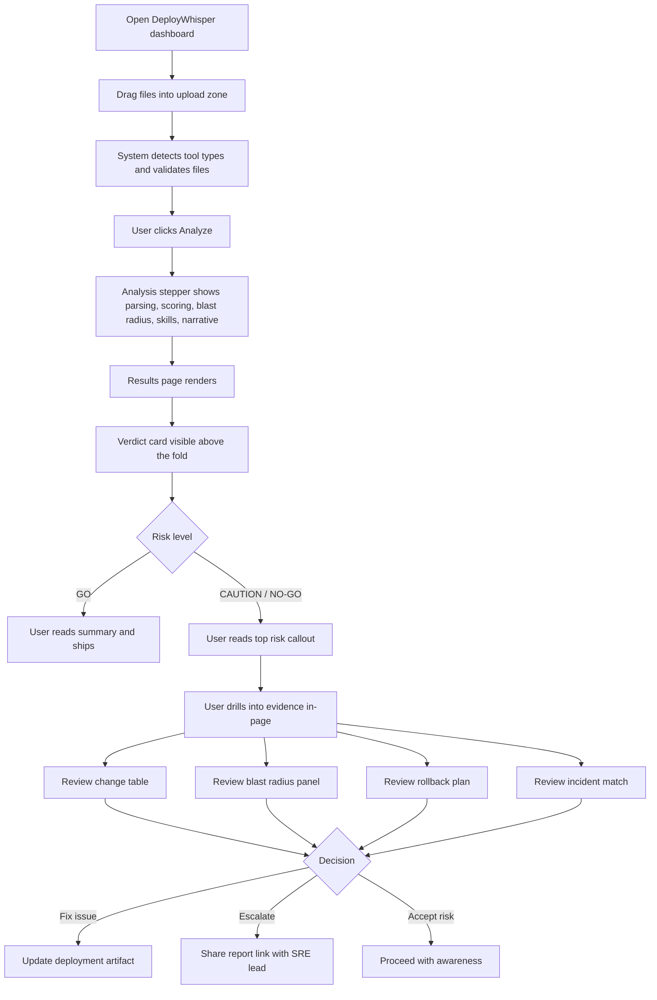
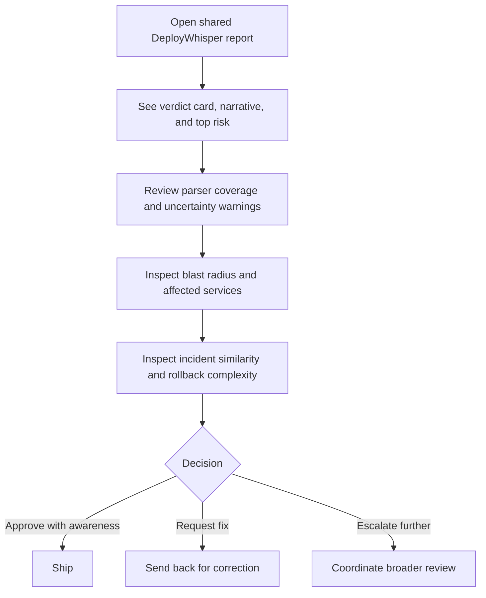
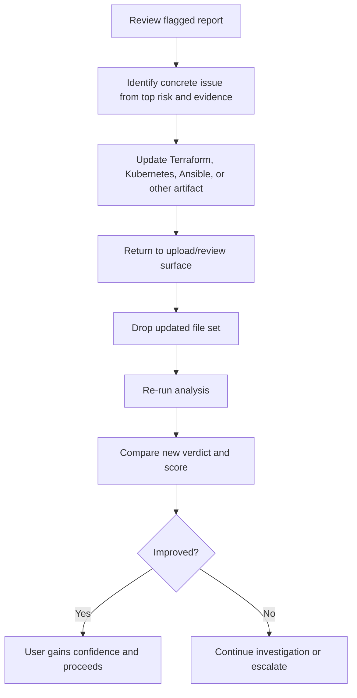
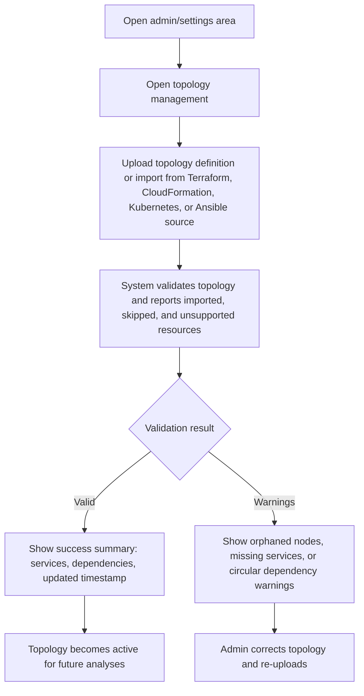
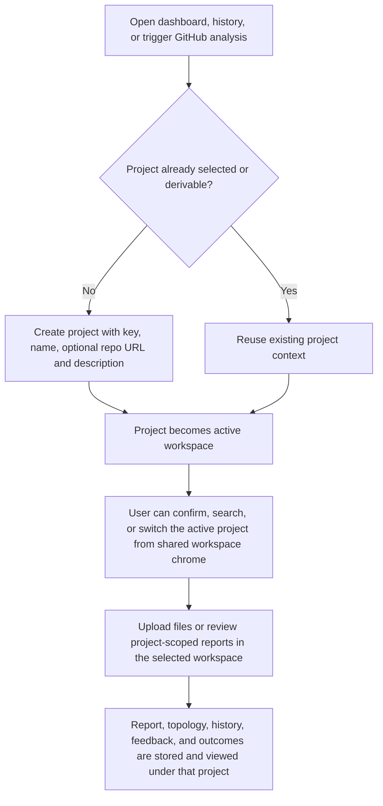
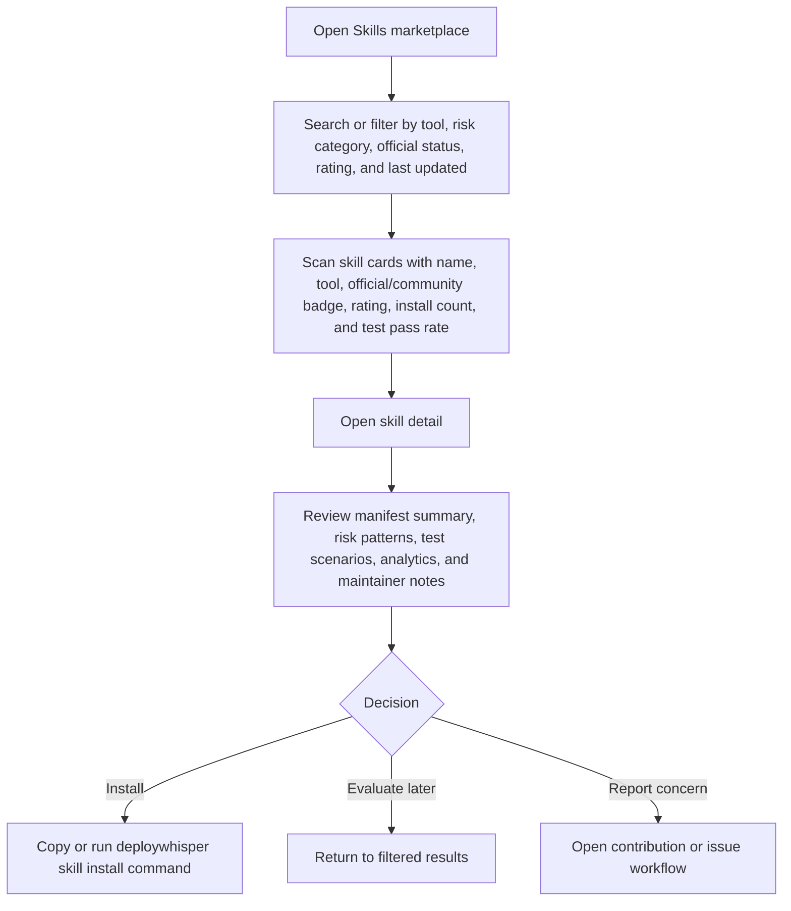
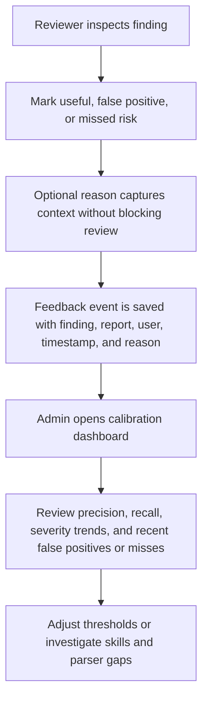
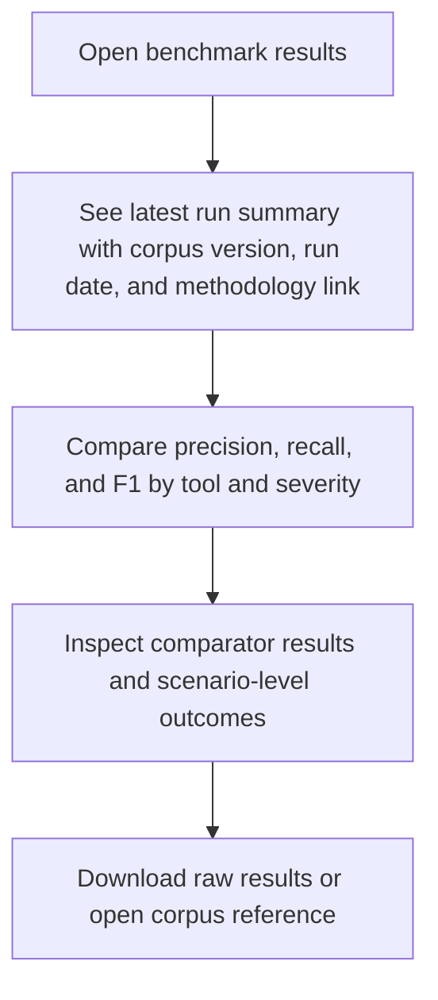

---
stepsCompleted:
  - step-01-init
  - step-02-discovery
  - step-03-core-experience
  - step-04-emotional-response
  - step-05-inspiration
  - step-06-design-system
  - step-07-defining-experience
  - step-08-visual-foundation
  - step-09-design-directions
  - step-10-user-journeys
  - step-11-component-strategy
  - step-12-ux-patterns
  - step-13-responsive-accessibility
  - step-14-complete
inputDocuments:
  - _bmad-output/planning-artifacts/prd.md
  - README.md
  - DeployWhisper_PRD.docx
  - DeployWhisper_Architecture.docx
lastStep: 14
status: 'complete'
completedAt: '2026-04-16'
---

# UX Design Specification deploywhisper

**Author:** psaho01
**Date:** 2026-04-16

---

<!-- UX design content will be appended sequentially through collaborative workflow steps -->

## Executive Summary

### 2026 UI Migration Design Authority

The approved React migration design system is now defined by
[`docs/ui-migration-plan.md`](../../docs/ui-migration-plan.md) Part B and
[`docs/design/deploywhisper-redesign-v3.jsx`](../../docs/design/deploywhisper-redesign-v3.jsx).
Those files supersede older retired UI-era visual guidance when exact values,
component anatomy, or migration scope differ.

For Phase 2 first-half delivery, the implemented design-system foundation is:

- `frontend/src/theme/tokens.css` and `frontend/src/theme/tokens.ts` expose Part B1 tokens as Tailwind theme tokens, CSS variables, and typed values.
- Color tokens cover brand, brand gradient, background/card/border/text surfaces, dark surfaces, severity foreground/background/dot colors, verdict fills, evidence green, and warning callout values.
- Typography tokens use local `@fontsource` families only: Plus Jakarta Sans Variable for display, Inter for body, and JetBrains Mono Variable for deterministic evidence.
- Geometry, depth, focus, and motion tokens cover card/inner/button/badge radii, all Part B1 shadows, score-ring animation, hover transitions, active-project ping, and reduced-motion behavior.
- `frontend/src/components/ui/` implements the Phase 2 primitive set: `SeverityBadge`, `VerdictChip`, `EvidenceTag`, `ConfidenceBadge`, `MonoRef`, `ScoreRing`, `Sparkline`, `Card`, `Button`, `SegmentedTabs`, `ProjectSwitcher`, and B4 skeleton variants.
- `/app/dev/components` is the temporary component-gallery route used for composed-container visual evidence. Product screens remain out of scope until later Phase 2/Phase 3 tasks.

### Project Vision

DeployWhisper is an internal, desktop-first pre-deployment risk intelligence tool for infrastructure and platform teams. Its UX purpose is to replace fragmented manual deploy review with one decision-ready analysis experience that feels trustworthy, fast, and operationally useful under pressure.

### Target Users

- Platform engineers running day-to-day pre-deploy review
- SRE and DevOps leads making go/no-go decisions
- Junior engineers learning from plain-English explanations
- Engineering managers reviewing audit history and risk trends
- Platform administrators managing topology, incident records, provider settings, and AI Skills
- Technical users integrating the API and CLI into CI workflows

### Key Design Challenges

- Make a complex multi-signal analysis understandable without overwhelming the user
- Preserve trust by clearly surfacing uncertainty, degraded modes, and partial failures
- Support both fast daily review and deeper investigation in the same interface
- Balance expert-level operational depth with readability for junior engineers and managers

### Design Opportunities

- Use staged progress and result presentation to make the analysis pipeline feel transparent rather than opaque
- Create strong information hierarchy so users can answer “is this safe to ship?” in seconds
- Turn explanations into a teaching layer, not just a warning surface
- Make blast-radius and impact reasoning feel concrete through visible, structured visualization

## Core User Experience

### Defining Experience

The core user experience of DeployWhisper is not file upload or data visualization in isolation. It is the moment immediately after analysis completes, when a platform engineer or SRE must determine what to do next. The primary interaction to optimize is: review the result and decide whether to ship, investigate further, or escalate. The interface succeeds when the user can move from “analysis complete” to “I know what to do” in seconds.

This makes DeployWhisper a decision-support product first and a reporting product second. The dashboard must prioritize judgment and clarity over completeness-on-first-view. Supporting detail matters, but only after the user has already understood the top-level outcome.

### Platform Strategy

DeployWhisper is a desktop-first internal web application optimized for mouse-and-keyboard use on engineering workstations. The primary context is an engineer reviewing deployment risk at a desk, often under time pressure, with multiple infrastructure artifacts already in play. Tablet readability matters as a fallback, but mobile workflows are out of scope.

The platform strategy should reinforce one-screen operational review. The user should not need multiple tabs, tool windows, or modal-heavy navigation to understand a deployment. The value of the product comes from collapsing a fragmented manual review workflow into one coherent workspace.

### Effortless Interactions

The most important interaction to make effortless is the answer hierarchy:
1. how risky is this
2. why is it risky
3. what systems are affected
4. how do we recover if it goes wrong

The result view should behave like a well-edited newspaper:
- headline: risk score and deploy recommendation
- lead: plain-English narrative
- supporting evidence: change table and blast radius
- appendix: rollback details and incident matches

The user should never need to scroll to find the verdict. Upload should feel trivial, progress should feel transparent, and the final answer should feel immediate. The interface should remove the cognitive burden of correlating changes across tools by surfacing that reasoning directly in the review flow.

### Critical Success Moments

The first “this is better” moment happens when the user reads a narrative that correctly connects multiple changes across different tools and explains the real deployment risk in one coherent statement. That moment proves the product understands the deployment as a system, not as disconnected files.

The make-or-break review moment is the first five-second scan after results appear. In that scan, the user must be able to answer:
- how risky is this
- what is the worst likely consequence
- should I ship, investigate, or escalate

If those answers are buried or ambiguous, the experience fails even if the backend analysis is technically correct.

### Experience Principles

- **Verdict first:** The deploy recommendation must always be visible above the fold and never buried behind supporting detail.
- **Reasoning before raw detail:** The user should understand the meaning of the deployment before digging into file-level evidence.
- **One-screen operational clarity:** The interface should replace multi-tab cognitive juggling with one coherent review surface.
- **Visible uncertainty:** Partial parsing, stale topology, or degraded analysis must be surfaced explicitly, never hidden.
- **Evidence on demand:** The user should be able to move from verdict to rationale to proof without losing orientation.
- **Intelligence is the product:** Visuals support trust, but the narrative proving correct cross-tool understanding is what creates the product’s real UX advantage.

## Desired Emotional Response

### Primary Emotional Goals

The primary emotional goal of DeployWhisper is to make the user feel in control. The product should not create passive calm or vague confidence. It should create the feeling that the user has the full picture, understands the risks, knows the recovery path, and can make a deliberate deployment decision with awareness rather than guesswork.

The interface should feel like switching on cockpit instruments before takeoff. The user remains the decision-maker, but the system gives them visibility, context, and operational awareness they would not otherwise have under time pressure.

### Emotional Journey Mapping

At first encounter, the product should create immediate clarity rather than visual overload. During the first five-second scan after analysis completes, the user should feel: “I know where I stand.” The combination of risk score, deploy recommendation, and top risk summary should resolve ambiguity before the user engages with any deeper evidence.

During a high-risk review, the user should feel grateful the issue was caught and prepared to act. The tone should feel like a calm, trusted senior teammate surfacing a meaningful concern, not a noisy alarm or an authoritarian block. When rollback guidance is visible alongside the warning, the product should convert anxiety into readiness.

When the system has partial or uncertain data, the user should feel trust because the tool is being honest. Visible uncertainty should strengthen credibility rather than weaken it. If topology is stale, parsing is partial, or historical matches are absent, the product should surface that explicitly so the user understands where the limits of certainty are.

On repeated use, the product should feel like a dependable operational companion. The emotional signature should be: “this feels like a senior SRE is reviewing with me.”

### Micro-Emotions

The most important micro-emotions for DeployWhisper are:
- clarity instead of overwhelm
- control instead of guesswork
- trust instead of skepticism
- preparedness instead of panic
- support instead of judgment
- informed caution instead of vague fear

Secondary positive micro-emotions include relief that the user no longer has to correlate cross-tool risk mentally, and respect for a system that is explicit about what it does and does not know.

### Design Implications

To create control, the interface must present the verdict, top risk, and next-action orientation immediately. To create clarity, the system must establish a strong hierarchy where summary comes before evidence and evidence comes before appendix-level detail. To create trust, the product must surface uncertainty and degraded modes plainly rather than hiding them.

To create preparedness during risky scenarios, warnings must be paired with context and recovery direction rather than isolated severity markers. To create the “senior SRE with me” feeling, the narrative tone must stay specific, calm, and operationally grounded rather than generic, punitive, or alarmist.

### Emotional Design Principles

- **Control over comfort:** The user should feel informed and capable, not merely reassured.
- **Clarity before depth:** The first scan should remove ambiguity before the user explores detail.
- **Calm seriousness:** Serious risks should feel important and actionable, not dramatic or panicked.
- **Honest uncertainty:** The system earns trust by showing what it does not know.
- **Support, not judgment:** The product should sound like an experienced teammate, not a scolding gatekeeper.
- **Preparedness beats fear:** Every warning should orient the user toward a next action, recovery path, or escalation choice.

## UX Pattern Analysis & Inspiration

### Inspiring Products Analysis

**Datadog**
Datadog is the strongest reference for information hierarchy under pressure. It surfaces the critical signal first, then lets the user drill into traces, logs, and correlations only if needed. The key lesson for DeployWhisper is that the first view should answer the highest-stakes question immediately, while deeper evidence remains available without dominating the screen.

**GitHub Pull Request Review**
GitHub PR review is the closest structural reference for the decision workflow. It presents status, summary, and detailed evidence in a clear review order, with the action point always visible. The key lesson for DeployWhisper is that deploy review should feel like an operational approval workflow, not like raw code browsing.

**Sentry**
Sentry is the best reference for explaining what went wrong, why it matters, and what is affected. It connects a single issue to broader impact and historical context without making the user sift through raw telemetry first. The key lesson for DeployWhisper is that incident similarity, blast radius, and rollback sequencing should be presented as fast operational context, not buried analysis detail.

**Linear**
Linear is the reference for discipline, focus, and interaction speed. Its interface feels respectful of technical users’ time by removing clutter and minimizing friction. The key lesson for DeployWhisper is that even though the product is information-dense, it should still feel fast, deliberate, and low-friction from first interaction onward.

### Transferable UX Patterns

**Summary-First Review Pattern**
Borrow from Datadog and GitHub:
- show the top-level status immediately
- keep the decision point visible above the fold
- place evidence beneath the summary rather than around it

For DeployWhisper, this becomes:
- risk score and GO / CAUTION / NO-GO badge first
- one-sentence top risk immediately below
- supporting evidence only after the verdict is clear

**Review Workflow Structure**
Borrow from GitHub PR review:
- status at top
- compact change summary next
- detailed supporting review below

For DeployWhisper, this maps to:
- verdict block
- narrative summary
- parser coverage/status rows
- change table
- blast radius
- rollback plan
- incident matches

**Correlation and Impact Pattern**
Borrow from Datadog and Sentry:
- connect one signal to broader operational consequence
- show what else is affected without forcing the user to infer it

For DeployWhisper, this means:
- cross-tool interactions surfaced directly in the narrative
- “affected services” visible near the blast-radius section
- incident similarity shown as operational context, not buried metadata

**Scannable History Pattern**
Borrow from Linear:
- rows should be quickly readable without opening each item
- each row should expose the minimum needed to decide whether to drill in

For DeployWhisper history, that means:
- risk badge
- timestamp
- tool icons / tool set
- short summary or top-risk label

**Sequential Recovery Pattern**
Borrow from Sentry breadcrumbs:
- recovery steps should read as a clear ordered sequence, not a block of prose

For DeployWhisper, rollback guidance should appear as a top-to-bottom operational sequence with simple step labels and effort cues.

### Anti-Patterns to Avoid

- Do not copy Datadog’s dashboard sprawl. DeployWhisper is a short-session decision tool, not an all-day monitoring surface.
- Do not copy GitHub’s raw diff aesthetic. The product should not feel like another file diff viewer.
- Do not copy Sentry’s stack-trace-heavy debugging presentation. The interface should read like a briefing, not an exception inspector.
- Do not copy Linear’s minimalism so aggressively that critical operational detail becomes hidden or flattened.
- Do not create a wall-of-data results page where the verdict is buried below charts, tables, and expandable sections.
- Do not hide parser gaps, stale topology, or degraded analysis states. Silent uncertainty is a trust-destroying UX failure.

### Design Inspiration Strategy

**What to Adopt**
- Datadog’s summary-to-drill-down hierarchy
- GitHub’s status-and-review workflow structure
- Sentry’s issue-to-impact-to-history framing
- Linear’s speed, restraint, and visual discipline

**What to Adapt**
- Datadog’s correlation model, but with much less UI complexity
- GitHub’s review structure, but without raw line-level code diff presentation
- Sentry’s regression/incident language, adapted into incident-match callouts
- Linear’s scannability, adapted to a more information-dense operational context

**What to Avoid**
- Monitoring-dashboard sprawl
- Diff-viewer mental model
- Debugger-style presentation language
- Minimalism that sacrifices operational clarity

**Strategic Design Direction**
DeployWhisper should combine the information hierarchy of Datadog, the decision workflow of GitHub PR review, the issue-context framing of Sentry, and the speed discipline of Linear. The result should feel like a focused deploy-review cockpit: decisive at the top, explanatory in the middle, evidentiary below, and never cluttered enough to slow judgment.

## Design System Foundation

### 1.1 Design System Choice

DeployWhisper uses a React SPA with a focused custom theme rather than a bespoke design system. The app relies on reusable React primitives, TanStack Table where table mechanics are needed, and DeployWhisper-specific visual tokens for verdict, confidence, evidence, and operational context.

The chosen approach is a balanced product-dashboard style: slightly polished, but still operationally credible. Summary panels and verdict surfaces should feel calm, intentional, and productized, while evidence-heavy areas such as the change table and blast radius remain information-dense and utilitarian.

### Rationale for Selection

This approach best matches the project’s constraints and goals:
- the backend team remains Python-heavy while the web surface is now React
- the product is an internal operational tool, not a consumer brand application
- speed, consistency, and trust matter more than bespoke visual novelty
- the interface must support both polished summary presentation and high-density operational detail
- React, Tailwind, TanStack Table, and the Phase 2 primitives provide stronger baseline mechanics than a small team could responsibly recreate in the same scope

A custom design system would add high cost without improving the core deploy-review experience. The correct strategy is to theme a proven system, then define a small number of product-specific components where the product has genuinely unique UX needs.

### Implementation Approach

The UI foundation uses standard React component primitives wherever possible:
- cards and panels for summary sections
- tables for structured evidence
- badges and chips for status
- drawers and navigation shells for layout
- progress components for staged analysis feedback
- dialogs and forms for settings/admin flows

Custom work should focus only on components with product-specific meaning:
- risk verdict block
- top-risk callout
- parser coverage status row
- incident match card
- rollback timeline
- blast-radius panel shell

This keeps implementation efficient while ensuring the key decision-support surfaces feel distinct and intentional.

### Customization Strategy

DeployWhisper should have moderate branding and a recognizable internal identity. The design system should not feel generic, but branding must never overpower the operational content.

**Branding direction**
- moderate product identity
- recognizable accent color and logo presence
- restrained, not loud
- strong enough that users recognize “this is DeployWhisper” at a glance

**Visual language**
- light-first operational theme
- restrained surfaces with soft contrast and disciplined borders
- clean card-based layout with one calm accent family
- generous whitespace in summary zones
- higher information density in evidence zones

**Design tokens to define explicitly**

**Color Tokens**
- primary accent: `#D85A30`
- background base: `#F7F8F4`
- card/surface: `#FFFFFF`
- secondary surface: `#F1F4EF`
- border/divider: `#D8DDD4`
- primary text: `#1D2420`
- muted text: `#66726B`
- risk tokens for `low`, `medium`, `high`, `critical`
- uncertainty token set distinct from risk states
- GO / CAUTION / NO-GO token set as a separate status family

**Typography Tokens**
- primary sans-serif: `DM Sans` or system sans fallback
- monospace: `DM Mono` or system monospace fallback
- weights: `400`, `500`
- sizes:
  - body: `14px`
  - secondary/caption: `12px`
  - section headers: `16px`

**Spacing Tokens**
- 4px base unit
- scale: `4 / 8 / 12 / 16 / 20 / 24 / 32`
- card padding: `20px`
- card gap: `16px`
- section spacing: `24px`

**Radius Tokens**
- small controls: `6px`
- cards/panels: `10px`
- compact table/small surfaces: `4px`

**Shadow Strategy**
- minimal, soft shadows only to separate white panels from the page background
- hierarchy still comes primarily from surface contrast, spacing, and borders

**Status Treatments**
Every status treatment must be defined consistently across:
- verdict badge
- risk gauge
- change table accents
- blast-radius nodes
- narrative panel accents
- parser coverage states
- uncertainty and degraded-analysis warnings

Each status must use:
- color
- text label
- optional icon or pattern

Color alone must never carry meaning.

### Design System Principles

- **Theme, don’t reinvent:** reuse React component defaults wherever they already solve the problem well.
- **Brand with restraint:** enough identity to feel intentional, never enough to compete with the analysis.
- **Flat, sharp, operational:** use contrast and spacing instead of shadows and ornamental depth.
- **Summary polished, evidence dense:** top-level judgment surfaces feel calm and refined; detailed evidence surfaces stay practical and information-rich.
- **Status consistency is trust:** the same risk or uncertainty state must look and mean the same thing everywhere in the product.

## 2. Core User Experience

### 2.1 Defining Experience

The defining experience of DeployWhisper is: receive a deploy briefing before production. The product’s core interaction is not file upload, raw diff inspection, or chart reading in isolation. It is the moment where a user turns a set of deployment artifacts into a decision-ready operational briefing that tells them whether to ship, investigate, or escalate.

This is the interaction users will describe to each other: “it gives you a deploy briefing before production.” That framing matters because it positions the product as a synthesis and decision-support tool rather than as another linter, diff viewer, or monitoring dashboard.

### 2.2 User Mental Model

The core mental model is a pre-flight checklist combined with a risk briefing.

The pre-flight checklist model gives the experience structure:
- this happens before something high-stakes
- it should be run every time, not only when something seems wrong
- it provides a systematic confidence check before action

The risk-briefing model adds the intelligence layer:
- the tool does not merely list findings
- it connects the dots between multiple signals
- it summarizes the situation in plain language
- it helps the user understand not only whether something is risky, but why

This combined mental model is stronger than PR review or incident dashboard framing. PR review implies code judgment, and incident dashboard implies failure has already happened. DeployWhisper is for deliberate pre-production review under operational stakes.

### 2.3 Success Criteria

The core interaction is successful when:
- the verdict is visible in under five seconds
- the top risk is explained in one sentence
- the rollback path is immediately available
- uncertainty is clearly labeled
- escalation is easy when needed

The interaction should feel complete when the user can answer:
- is this safe to ship
- what is the worst likely consequence
- what do I do next

### 2.4 Novel UX Patterns

DeployWhisper does not require a radically new interaction pattern. Its novelty comes from combining familiar patterns into a new workflow:
- monitoring-style risk status
- PR-review-style change summary
- AI-style narrative explanation
- service-map-style blast radius
- runbook-style rollback guidance
- pipeline-style staged progress

This is an intentional UX strategy. Users should not need to learn a new interaction grammar. The product should feel immediately legible because every major interface pattern is already familiar from other engineering tools, even though the overall workflow is new.

### 2.5 Experience Mechanics

**1. Initiation**
The user drags deployment artifacts into the upload zone. The system immediately shows each file with its detected tool type and validation status. The user confirms the submission by starting analysis.

**2. Interaction**
The system processes the submission through visible stages such as parsing, scoring, blast-radius mapping, AI Skill loading, and narrative generation. Progress is shown in real time so the user understands what is happening.

**3. Feedback**
When analysis completes, the dashboard presents the answer hierarchy immediately:
- risk gauge and GO / CAUTION / NO-GO verdict
- narrative summary
- top risk callout
- deeper evidence below, including change table, blast radius, rollback plan, and incident matches

**4. Completion**
The user knows the interaction is complete when they can make one of three decisions:
- ship
- fix and re-run analysis
- escalate for further review

The report is already persisted when the result is shown, so the user does not need a separate save action. If escalation is needed, the result should be easy to share into the team’s existing communication flow.

## Visual Design Foundation

### Color System

DeployWhisper uses a light-first operational palette. The interface should feel calmer and easier to scan during longer review sessions, while preserving a restrained but recognizable product identity built around a single accent family and disciplined operational contrast.

**Core palette**
- primary accent: `#D85A30`
- base background: `#F7F8F4`
- card / surface background: `#FFFFFF`
- secondary surface background: `#F1F4EF`
- border / divider: `#D8DDD4`
- primary text: `#1D2420`
- muted text: `#66726B`

**Color roles**
- the coral accent is the only product accent color family
- accent usage is limited to brand mark, interactive emphasis, selected states, and controlled highlights
- risk colors are status tokens, not brand accents
- uncertainty states use their own warning treatment and must remain visually distinct from risk severity

**Status token families**
- `low`
- `medium`
- `high`
- `critical`
- `uncertain / degraded`

Each status family must define:
- badge background
- badge text color
- icon treatment
- gauge color usage
- graph node treatment
- panel accent treatment where relevant

Severity badges should use pale tinted backgrounds with matching text and a thin border. Severity color must stay contained inside badges or compact indicators rather than washing whole rows or panels.

No gradients are allowed inside status treatments. Core surfaces should use flat fills, restrained shadows, contrast, and borders for hierarchy.

### Typography System

DeployWhisper uses a restrained, product-grade typography system optimized for operational readability.

**Primary typeface**
- `'DM Sans', -apple-system, 'Segoe UI', sans-serif`

**Monospace typeface**
- `'DM Mono', ui-monospace, SFMono-Regular, monospace`

**Usage**
- DM Sans for all general UI text, headings, navigation, labels, and narrative content
- DM Mono for resource names, identifiers, code references, file names, and structured technical values

**Weight strategy**
- `400` regular
- `500` medium

**Size system**
- body: `14px`
- secondary / caption: `12px`
- section headers: `16px`

No text below `12px` is allowed anywhere in the interface.

### Spacing & Layout Foundation

The layout should maintain the current balance between polished summary space and denser operational evidence.

**Base unit**
- `4px`

**Spacing scale**
- `4 / 8 / 12 / 16 / 20 / 24 / 32`

**Defaults**
- card padding: `20px`
- card gap: `16px`
- section spacing: `24px`

**Layout principle**
- verdict zone is spacious
- evidence zone is denser
- this contrast is intentional and should act as a hierarchy signal:
  - spacious = answer
  - dense = evidence

The verdict area should breathe. The detail area should compress information efficiently without becoming noisy.

### Accessibility Considerations

DeployWhisper uses practical accessibility standards as hard visual rules, not optional polish.

**Contrast**
- minimum `4.5:1` contrast ratio for all body text
- minimum `3:1` for large text (`16px+` bold)
- all text tokens must be validated against their background surfaces
- muted secondary text must never become aesthetically “cool” at the expense of readability

**Status legibility**
- status meaning must never rely on color alone
- all status treatments require text labels
- table rows must preserve text readability regardless of adjacent badges, icons, or risk markers
- status color belongs inside contained treatments, not across full-row background washes

**Readable minimums**
- no text smaller than `12px`
- semantic HTML and keyboard-first interactions remain part of the visual system, not just implementation behavior

### Non-Negotiable Visual Rules

- The verdict card must always appear above the fold on a 1080p display.
- No gradients.
- No decorative illustrations.
- Only one accent color family is allowed for product branding.
- Graph visuals must prioritize legibility over flair.

### Visual Hierarchy Rules

- The first screen must show:
  - risk gauge
  - GO / CAUTION / NO-GO badge
  - first sentence of the narrative
- The top-risk callout must appear immediately below or adjacent to the primary verdict area
- Change table, blast radius, rollback plan, and incident matches belong to the deeper evidence layer
- The user should never scroll to discover whether the deploy is safe

### Graph Visual Rules

The blast-radius graph is a legibility-first operational artifact.

- static or controlled layout over playful motion
- readable labels at all times
- clear distinction between direct and transitive impact
- explicit legend
- no physics-driven bouncing, glow effects, or decorative 3D styling
- node color and size must support understanding, not spectacle

### Visual Foundation Principles

- **Prototype is source of truth:** maintain continuity with the approved dashboard direction.
- **Single accent discipline:** branding should feel intentional, never noisy.
- **Answer first, evidence second:** spacing and contrast must reinforce decision hierarchy.
- **Operational calm:** the interface should feel sharp and serious, not dramatic.
- **Readable in the real world:** dark mode must remain legible on everyday engineering laptops, not just ideal high-end displays.

## Design Direction Decision

### Design Directions Explored

The design exploration considered six directions:
- verdict-first cockpit
- briefing panel split
- review workflow
- incident operations console
- narrative-led briefing
- scannable history plus quick review

Each direction preserved the same design principles but emphasized different strengths: verdict hierarchy, narrative weight, incident framing, review familiarity, or repeat-use efficiency.

### Chosen Direction

The chosen direction is a hybrid:
- **base structure:** Direction 2 — Briefing Panel Split
- **borrowed element:** parser coverage/check rows from Direction 3
- **borrowed element:** history scanability from Direction 6

This means the primary product surface will use a two-part deploy-briefing layout:
- top verdict and narrative zone with strong summary clarity
- supporting operational evidence below

It also means:
- parser coverage is made explicit as an early trust signal
- the history view is optimized for quick scanning and retrieval, not verbose browsing

### Design Rationale

Direction 2 is the best base because it most closely matches the product’s defining interaction: receive a deploy briefing before production. It gives the narrative enough space to feel like a trusted operational summary while still preserving strong top-level status visibility.

Adding parser checks from Direction 3 improves trust by making analysis coverage explicit. Users can see immediately which parts of the deployment were analyzed successfully and where uncertainty or parser issues exist.

Adding the history pattern from Direction 6 supports the repeat-use behavior of the product. Past analyses become easy to scan by risk, timestamp, and tool mix without turning the history page into another dense dashboard.

This combination best supports the product’s emotional goals:
- in control
- clear in the first five seconds
- supported by a tool that feels honest and operationally aware
- never forced to hunt for the verdict or wonder what the system actually analyzed

### Implementation Approach

The interface should be implemented with these priorities:

- **Primary review page**
  - briefing-panel layout from Direction 2
  - verdict, badge, narrative, and top-risk callout above the fold
  - parser coverage row immediately visible near the top of the report
  - deeper evidence below: change table, blast radius, rollback plan, incident matches

- **Parser coverage treatment**
  - one compact row per analyzed tool
  - explicit success / warning / failure status
  - visible handling of partial analysis and uncertainty

- **History page**
  - compact, Linear-inspired scanable rows
  - each row shows risk badge, timestamp, tool set, and short summary
  - report selection opens into the same verdict-first briefing structure used for current analyses

- **Overall UX rule**
  - preserve the deploy-briefing mental model
  - keep the summary calm and spacious
  - keep the evidence structured and operational
  - never let supportive UI patterns compete with the top-level decision

## User Journey Flows

### Platform Engineer: Pre-Deployment Review Loop

This is the primary UX flow and the most detailed interaction in the product. It begins with artifact submission and ends with a decision: ship, investigate further, fix and re-run, or escalate. The key UX requirement is that the user never loses the answer hierarchy while moving deeper into the evidence.

The defining design rule in this flow is that CAUTION and NO-GO do not force a navigation jump. The user remains on the same page, with the evidence sections directly beneath the verdict. The verdict card, top-risk summary, and share action stay visible or easily recoverable while the user investigates.

### SRE Lead: Escalation Review Flow

This flow begins when a platform engineer shares a flagged report. The SRE lead does not need the full upload experience; they need fast access to the decision context and the evidence required for a go/no-go call.

The UX priority here is not exploration but confidence. The SRE lead needs to feel that the report is a briefing packet, not a dashboard they must learn.

### Platform Engineer: Fix and Re-Run Loop

This is a critical coaching loop. It proves that the product is not just a warning surface but a feedback system that rewards correction with visible improvement.

The key UX moment here is visible improvement. If the risk score drops and the top risk changes after a fix, the product reinforces learning and builds trust.

### Platform Admin: Topology Update and Validation Flow

This is the most important admin flow because topology accuracy directly affects blast-radius trust. The critical experience is not just editing data, but receiving immediate confirmation that the new context is valid and active.

A secondary admin validation pattern should apply to custom AI Skills as well: when overrides or new skills are detected, the system should confirm exactly what it found and how it will be used.

### Project Workspace Selection Flow

Before upload or repository-triggered analysis becomes routine across multiple teams, the user needs one stable container that answers: which project does this report belong to? The product should solve that with a lightweight project/workspace flow, not enterprise tenancy.

This flow should feel closer to SonarQube's project key model than to an enterprise org/admin setup. The user should not have to think about RBAC, SSO, team hierarchy, or hosted SaaS boundaries to isolate reports cleanly.

### Public Skills Marketplace Browse Flow

The public Skills marketplace must support fast discovery and credibility assessment without turning the product into a generic app store. The primary user goal is to decide whether a skill is relevant, safe enough to install, and actively maintained.

Marketplace browse surfaces should keep evidence of trust visible on every repeated item: official/community status, test pass rate, last updated timestamp, install count, and rating. Search and filters should use compact controls above the list, not a landing-page layout. Skill detail pages should lead with the skill's operational purpose and compatibility, then show manifest fields, test results, analytics, examples, and contribution metadata.

### Reviewer Feedback and Calibration Flow

Reviewer feedback is part of the learning loop, not a decorative reaction control. Feedback controls must appear where the user is already evaluating findings, and calibration views must explain whether DeployWhisper is becoming more or less reliable over time.

Feedback controls should be compact and per-finding. The UI should not interrupt the review flow with a modal unless the user chooses to add detail. Calibration dashboards should use summary metrics first, then drill-down tables for false positives, false negatives, and severity changes. Trend views must be filterable by time window, tool, environment, and severity.

### Benchmark Results Dashboard Flow

Benchmark pages are proof surfaces. They should prioritize methodology, repeatability, and comparison clarity over marketing ornament.

The benchmark dashboard should show the latest published results, corpus version, DeployWhisper version, comparator versions, and run timestamp near the top. Tables should support filters by tool, severity, comparator, and scenario outcome. Scenario detail rows should expose expected findings, actual findings, reviewer rationale, and whether the result matched ground truth. Raw result downloads and methodology links must be visible from the first viewport.

### Journey Patterns

Across these flows, the product should standardize these interaction patterns:

- **Verdict-first entry:** every analysis result opens with the verdict, not the evidence.
- **In-page drill-down:** users inspect deeper evidence without losing the main decision context.
- **Visible uncertainty:** parser gaps, stale topology, and degraded analysis states are explicit and persistent.
- **Feedback loops:** when users fix something and re-run analysis, the product should make the improvement legible.
- **Shareable decision state:** escalation should happen from the report the user is already reading, not from a separate export workflow.

### Flow Optimization Principles

- Keep the main review loop on one screen whenever possible.
- Treat CAUTION and NO-GO as “investigate here” states, not “go somewhere else” states.
- Prioritize evidence that explains the verdict before exhaustive detail.
- Make re-run behavior fast and obvious, because it is both a remediation path and a learning loop.
- In admin flows, validate configuration changes immediately so the user never wonders whether the system understood their update.

## Component Strategy

### Design System Components

The product should rely on React component primitives for all standard application structure and interaction primitives. These should be themed, not reimplemented.

**Use design-system components directly for:**
- app shell and sidebar navigation
- top navigation and page headers
- cards and generic panels
- buttons and button groups
- tabs and segmented controls
- dialogs and confirmation modals
- forms, dropdowns, toggles, text inputs, radio groups
- notifications and snackbar-style feedback
- progress indicators and steppers
- base table behaviors
- standard badges and chips as the structural base for status treatments

These components should remain stock React component primitives with DeployWhisper token styling applied. They should not become custom abstractions unless a clear product-specific behavior requires it.

### Custom Components

Custom components should exist only where the product has unique operational semantics that a generic component library does not cover.

#### VerdictCard

**Purpose:**
Provide the primary above-the-fold deploy verdict and establish the answer hierarchy for the entire page.

**Usage:**
Always appears at the top of an analysis result. It is the first thing the user sees after analysis completes.

**Anatomy:**
- risk gauge
- GO / CAUTION / NO-GO badge
- score value
- opening sentence of the narrative
- top risk summary
- persistent secondary actions such as share / re-run

**States:**
- loading
- low / medium / high / critical
- uncertain / degraded analysis
- re-analysis result state

**Accessibility:**
- status never conveyed by color alone
- verdict text always explicit
- gauge must expose textual equivalent
- actions keyboard reachable

**Interaction Behavior:**
Acts as the anchor for the review page. It should never disappear from the user’s understanding, even when they drill deeper into evidence.

#### TopRiskCallout

**Purpose:**
State the most important risk in one sentence.

**Usage:**
Directly below or adjacent to the VerdictCard.

**Anatomy:**
- label
- concise risk statement
- optional supporting context
- severity styling

**States:**
- low-risk informational
- elevated-risk warning
- critical-risk alert
- uncertain context variant

#### ParserCoverageRow

**Purpose:**
Show what the system actually analyzed and where uncertainty exists.

**Usage:**
Compact summary directly under the VerdictCard, with deeper detail reflected in lower evidence sections.

**Anatomy:**
- one compact status item per tool
- analyzed / warning / failure states
- file count and change count summary

**States:**
- success
- partial
- failed
- skipped due to sensitivity or unsupported input

#### ChangeRiskTable

**Purpose:**
Present resource-level change evidence with risk cues.

**Implementation Strategy:**
Custom wrapper around TanStack Table, not a bespoke table implementation.

**Custom additions:**
- risk-weight visual treatment
- tool icon badge
- action-type pill
- monospace resource-name styling
- grouped or filterable evidence views

**Reason:**
React SPA already solves table mechanics; DeployWhisper adds domain-specific evidence semantics.

#### BlastRadiusPanel

**Purpose:**
Present downstream impact in a trustworthy, readable way.

**Implementation Strategy:**
Panel shell plus separate graph subcomponent.

**Panel shell responsibilities:**
- title and section framing
- legend
- topology staleness warning
- empty state
- loading state

**Graph subcomponent responsibilities:**
- node and edge rendering
- impact depth display
- zoom/pan behavior if needed
- click-to-inspect details

This separation preserves flexibility if the underlying graph renderer changes later.

#### RollbackTimeline

**Purpose:**
Show recovery as a sequential operational plan rather than a paragraph.

**Anatomy:**
- ordered step list
- effort or complexity indicator
- optional timing cues
- dependency or critical-step highlighting

**States:**
- standard
- high-complexity
- incomplete / degraded

#### IncidentMatchCard

**Purpose:**
Present historical incident similarity as operational context.

**Anatomy:**
- incident title
- date
- severity
- similarity score
- short explanation of why the match matters

**Interaction Behavior:**
Should feel like a regression or prior-incident signal, not a raw database lookup.

#### AnalysisHistoryRow

**Purpose:**
Make history scannable at speed.

**Usage:**
Primary repeated unit in the history page.

**Anatomy:**
- timestamp first
- prominent risk badge
- compact tool icons
- one-line top-risk summary
- fully clickable row behavior

**Priority:**
Scanability first, risk badge prominence second, detail only as needed.

#### SkillMarketplaceCard

**Purpose:**
Make skills easy to compare by relevance and trust signals.

**Usage:**
Repeated unit in the Skills marketplace browse page.

**Anatomy:**
- skill name and short purpose
- tool or domain badge
- official/community/featured status
- rating, install count, test pass rate, and last updated
- primary install or detail action

**Interaction Behavior:**
The entire card opens the detail page. Install remains a distinct action so users do not accidentally install while browsing.

#### SkillDetailPanel

**Purpose:**
Show the information needed to decide whether a skill is relevant and safe to install.

**Anatomy:**
- manifest summary
- compatible DeployWhisper version
- risk patterns detected by the skill
- test scenarios and latest pass rate
- analytics such as installs and last updated
- maintainer, contribution, and issue links

#### FindingFeedbackControl

**Purpose:**
Capture reviewer judgment on individual findings without disrupting review.

**Anatomy:**
- useful / false positive / missed risk controls
- optional reason selector
- optional free-text note
- saved-state indicator

**Interaction Behavior:**
Feedback submission should be inline and reversible where possible. Detailed reason entry should be optional and should not block the main deploy decision.

#### CalibrationMetricPanel

**Purpose:**
Show admins whether DeployWhisper is calibrated over time.

**Anatomy:**
- precision, recall, and F1 summary
- severity breakdown
- false positive and false negative trend
- time-window selector
- drill-down link to feedback events and deployment outcomes

#### BenchmarkResultsTable

**Purpose:**
Present public benchmark outcomes with enough context to audit product claims.

**Anatomy:**
- corpus version, run date, DeployWhisper version, comparator versions
- precision, recall, and F1 by tool and severity
- scenario-level expected versus actual results
- raw result download action
- methodology link

**Interaction Behavior:**
Filters should support tool, severity, comparator, and scenario outcome. Scenario rows expand in place to show reviewer rationale and matched or missed findings.

### Component Implementation Strategy

- Stock React component primitives remain stock wherever possible.
- Custom components are reserved for domain-specific UI only.
- The product should prefer wrappers and composition over reinvention.
- The change table must be a wrapper around TanStack Table mechanics.
- The blast radius UI must separate shell framing from graph rendering.
- Parser coverage should appear in two levels:
  - compact trust signal near the top
  - richer tool-specific evidence lower in the page

### Implementation Roadmap

**Phase 1 - Core Components**
- VerdictCard
- TopRiskCallout
- ParserCoverageRow
- ChangeRiskTable
- BlastRadiusPanel
- RollbackTimeline

These components support the primary deploy-review flow and the five-second scan requirement.

**Phase 2 - Supporting Components**
- IncidentMatchCard
- AnalysisHistoryRow
- richer grouped parser detail sections
- admin context confirmation panels

These components improve repeat use, trust, and operational depth.

**Phase 3 - Enhancement Components**
- any advanced comparison or diff-oriented history views
- optional deeper graph interaction affordances
- richer reusable admin context-management surfaces

### Component Principles

- **Custom only where meaning is unique**
- **Wrap, don’t rebuild**
- **React primitives for mechanics, DeployWhisper for semantics**
- **Verdict first, everything else supports it**
- **Every custom component must earn its maintenance cost**

## UX Consistency Patterns

### Button Hierarchy

DeployWhisper uses a strict button hierarchy so the interface always reflects the user’s likely next decision.

**Primary action rules**
- only one primary CTA per zone
- in the upload flow, the primary action is `Analyze`
- in the review flow, evidence remains the main focus while `Share` and `Re-run` remain visible as persistent secondary actions

**Secondary action rules**
- secondary actions support escalation, re-analysis, or contextual configuration
- secondary buttons should never visually compete with the verdict itself

**Danger/destructive action rules**
- only used for destructive admin actions
- always require explicit confirmation

### Feedback Patterns

DeployWhisper must communicate outcomes with high clarity and low drama.

**Success**
- calm and low-friction
- confirms completion without stealing focus from the result

**Risk warnings**
- explicit and immediately visible
- seriousness comes from hierarchy and wording, not alarmist styling

**Degraded analysis**
- uses a distinct uncertainty treatment, separate from risk severity
- makes clear what the system could not confirm or complete

**Parser and topology warnings**
- visible in context
- never hidden in logs or behind expandable technical detail by default

### Form Patterns

Forms in DeployWhisper should stay direct, low-friction, and confirm system understanding clearly.

**Validation**
- inline validation first
- field-level feedback where possible
- no generic “something went wrong” form errors when a specific problem can be named

**Confirmation**
- only required for destructive or high-impact admin actions
- standard settings saves should confirm success without interruptive dialogs

**Import workflows**
- topology, incident, and custom-skill flows must always confirm what the system understood
- uploaded configuration should produce explicit success or warning summaries

### Navigation Patterns

DeployWhisper favors in-page review over navigation-heavy workflows.

**Main navigation**
- route-level navigation for dashboard, history, settings, and admin areas
- stable left-side shell navigation using stock React shell patterns
- the left navigation must remain visible on desktop and serve as the primary page-switching control
- shared workspace chrome should keep the active project/workspace visible and allow project switching without forcing a detour through the dashboard upload flow
- branding sits at the top of the navigation rail, followed by page links in a simple vertical list

**Review navigation**
- investigation happens in-page
- users drill down through scroll, section focus, or expansion rather than moving to separate detail screens

**History interaction**
- report rows are directly clickable
- selecting a history item opens the same verdict-first review structure used for current analyses
- the History page includes a clear Back button to return to the dashboard without relying on browser navigation

**Page header behavior**
- each routed page uses a concise page header with eyebrow, page title, and short supporting description
- secondary pages such as History and Settings include an explicit Back action to the dashboard

### Loading and Empty-State Patterns

**Loading**
- always stage-based, never spinner-only
- progress language must mirror the actual backend analysis pipeline
- users should always know what phase the system is in

**Empty states**
- no decorative illustrations
- one short line of context
- one clear next action

**Re-run pattern**
- re-analysis should feel like a continuation of the same review loop, not a separate workflow
- improved results should be visibly legible when a fix reduces risk

### Search and Filtering Patterns

Search and filtering should reduce noise, not turn the product into an exploratory analytics tool.

**History filtering**
- optimized for fast retrieval by time, risk level, and tool mix
- designed for pattern matching and quick recall

**Evidence filtering**
- optional grouping or filtering in dense evidence views
- must preserve clarity and never obscure the top-level verdict

### Additional Patterns

**Trust pattern**
- always show what was analyzed
- always show what was uncertain
- never imply complete certainty when data is partial

**Escalation pattern**
- sharing a report should happen from the same review context
- escalation is an extension of the verdict flow, not a separate export workflow

**Consistency rule**
- every interface state should help the user answer one of three questions:
  - what is the verdict
  - why is the verdict what it is
  - what should I do next

## Responsive Design & Accessibility

### Responsive Strategy

DeployWhisper is designed desktop-first. The primary operating context is an engineer reviewing a deployment on a desktop or laptop workstation with mouse-and-keyboard input. Tablet layouts are supported as a readability fallback, but mobile is not a target platform for full review workflows.

Responsive adaptation should preserve the product’s information hierarchy rather than optimize for full feature parity across all screen sizes. Summary and verdict surfaces remain the highest priority at every breakpoint. Supporting evidence may stack, compress, or simplify as screen space narrows, but the decision-support structure must remain intact.

Mobile viewports receive graceful degradation only. Text content remains readable and the verdict stays visible, but the full review workflow is not optimized for screens below `768px`.

### Breakpoint Strategy

Use standard breakpoints with a desktop-first implementation strategy:

- **Desktop:** `1024px+`
- **Tablet:** `768px–1023px`
- **Mobile / narrow fallback:** `<768px`

**Breakpoint behavior rules**
- desktop layouts may use multi-column structure and denser evidence presentation
- tablet layouts may stack evidence panels vertically and reduce graph density
- narrow/mobile layouts may simplify secondary visuals, but must preserve verdict clarity and textual impact explanation

**Non-negotiable layout rules**
- the VerdictCard must remain first in DOM order and visual order at every breakpoint
- evidence sections may stack, but the verdict hierarchy must never change
- the blast-radius graph may simplify or collapse on smaller screens, but it must never replace the textual impact summary

### Accessibility Strategy

DeployWhisper follows a practical accessibility strategy aligned to WCAG AA contrast and keyboard expectations, without claiming formal audited compliance.

**Core accessibility requirements**
- body text minimum contrast ratio: `4.5:1`
- large text minimum contrast ratio: `3:1`
- keyboard navigation across all core workflows
- semantic HTML for content, tables, and structural regions
- explicit text labels alongside all color-coded statuses
- uncertainty and degraded-analysis states surfaced visibly and in text

**Graph and visualization accessibility**
- visualizations must always have textual equivalents or summaries
- the blast-radius graph is supplementary to the textual impact summary, not a replacement
- if visual density makes the graph unreadable on smaller screens, a text-first impact representation takes precedence

### Testing Strategy

Responsive and accessibility behavior must be verified manually as well as through routine tooling.

**Manual verification requirements**
- verify the VerdictCard is fully visible without scrolling on a `1920x1080` display at `100%` browser zoom with browser chrome visible
- verify keyboard-only navigation through the main review flow, settings, and admin workflows
- verify tablet readability and stacked layouts for the main result page
- verify that parser coverage, risk badges, and top-risk callouts remain legible under all status states

**Additional validation**
- contrast checks for all tokenized text and status treatments
- browser validation in Chrome, Edge, and Firefox
- color-blind-safe review of all status patterns
- responsive checks for graph fallback behavior and summary preservation

### Implementation Guidelines

- implement layouts desktop-first, not mobile-first
- preserve verdict-first structure at every breakpoint
- allow evidence panels to stack before reducing the verdict zone
- never reduce text below `12px`
- never use row-wide status backgrounds that reduce evidence readability
- always keep a textual explanation available when a visual component simplifies or degrades
- prefer readability and information preservation over visual symmetry on smaller screens

### Responsive & Accessibility Principles

- **Desktop is the real workflow:** optimize the primary review loop for the screen size users actually work on.
- **Hierarchy survives compression:** smaller screens may simplify layout, never the decision structure.
- **Readable before beautiful:** accessibility and clarity take priority over compactness or decoration.
- **Text is the fallback of truth:** if a visual cannot scale cleanly, the text summary carries the information.
- **Honest support boundaries:** mobile is readable, not fully operational.
