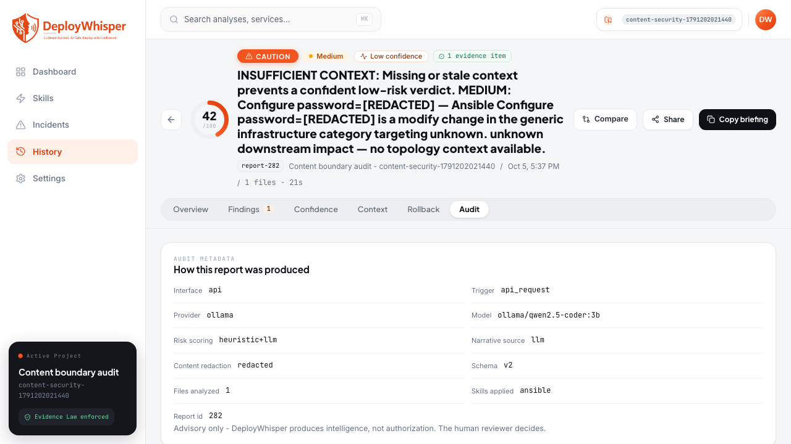

# Secrets and Raw Artifact Boundary Audit

Story 12.1 protects analysis inputs, provider prompts and responses, persisted
reports, local artifact snapshots, API errors, and application logging. The
default provider remains Ollama. Selecting a hosted provider explicitly enables
outbound structured summaries; uploaded artifact bytes are never a prompt input.
Provider credentials remain environment-backed rather than database-backed.

## Audited boundaries

| Boundary | Protection | Regression evidence |
| --- | --- | --- |
| Intake and parsing | Existing sensitive filename exclusions remain enabled. Parser failures expose a category or exception class, without source excerpts. | `tests/test_services/test_content_security.py`, intake/parser suites |
| Severity, interaction confidence, and narrative prompts | Structured summaries are screened before calls. Detected values from every submitted input, including failed and excluded uploads, protect derived prose through all scoring and narration paths. Severity prompts omit parser metadata. Raw bytes remain local for screening, permitted rules, and skill selection. | `tests/test_llm/test_content_boundary.py`, `tests/test_services/test_analysis_content_boundary.py`, `tests/test_services/test_content_security.py` |
| Provider facade | JSON message bodies are screened recursively. Credential patterns and the configured API key are redacted. Sensitive responses are blocked, including JSON-escaped values. | `tests/test_llm/test_content_boundary.py` |
| Generated narrative and reasoning | Unsafe responses produce an explicit blocked notice and deterministic fallback. Provider failures expose safe fixed notices or exception classes. | narrator/provider and prompt-injection suites |
| Report persistence and reads | Shared service screening covers findings, evidence, context, narrative, warnings, and audit metadata. Repository writes screen nested JSON too. Read serialization also screens recognizable secrets in older rows. | `tests/test_services/test_report_service.py`, `tests/test_services/test_content_security.py` |
| Local artifact snapshots | Sensitive filenames are excluded. Detected sensitive content is replaced by a blocked-content notice; clean artifacts stay local for review. Older snapshots are screened when read. | `tests/test_services/test_content_security.py` |
| API errors | Validation inputs and exception context are omitted. Other error details are screened. Unhandled errors use a generic public response and class-only event log. | `tests/test_api/test_error_security.py` |
| Logs | Application, migration, and Uvicorn startup retain the shared safe console configuration. Output redacts credential patterns, omits exception values/tracebacks/source lines, and suppresses SDK debug payload dumps and SQL parameter logging. | `tests/test_infra/test_logging_security.py`, `tests/test_infra/test_logging_startup_security.py` |
| Telemetry | No outbound telemetry exporter was found in this audit. Local aggregate stats use report counts and derived metrics. | Code inspection of logging, application, and report/stat paths |

## Detection and visible outcomes

The shared screen recognizes credential-bearing keys such as password, API key,
access key, secret, token, private key, and connection string; private-key blocks;
common provider/GitHub/AWS token patterns; authorization values; credential-bearing
URLs; named secret environment values; Kubernetes Secret `data`/`stringData`;
and Terraform sensitive-value masks/output descriptors. Screening handles
escaped quotes, multiline scalar values, quoted YAML keys, `SECRET_KEY` labels,
and standard decoded Kubernetes Secret values. Locally detected values are also
removed from derived prose and numeric metadata. Schema keys, public enums,
scores, IDs, and counts retain their contract meanings. Large valid analyses
retain typed report structures; repeated YAML graph nodes are visited once.

Screened values appear as `[REDACTED]`. Reports retain a warning and expose
`audit.redaction_status`, `audit.redaction.content_redacted`, per-artifact
`submission_manifest.items[].redaction_status`, and evidence redaction statuses.
The Report Audit tab displays **Content redaction** using the existing metadata
card. A sensitive accepted artifact can still contribute deterministic evidence;
its snapshot is blocked. Excluded sensitive filenames use `sensitive_blocked`.
Sensitive model output displays a blocked failure notice and degraded narrative.
Severity and Evidence Law remain deterministic and advisory.

Recognizable credentials in artifact filenames are excluded before parsing or
snapshot manifest writes. Their outcome uses the existing `sensitive_blocked`
status. A failed parser does not remove its detected credentials from the
screening context used by valid sibling artifacts.

API and CLI intake responses use the screened manifest names. If an artifact
name itself matches a detected credential, a stable hash-based alias preserves
its correlation through evidence, manifests, and snapshot lookup. The extension
is retained when it is safe; an overlapping suffix uses a neutral hash identity.
The original intake classification and tool family are preserved.
Parsing and local ownership resolution use the original name before publication.
Redaction status follows the first screening pass and batch-only snapshot blocking.

Credential collection recognizes escaped source strings, whitespace in base64
Secret data, and CloudFormation intrinsic tags/NoEcho defaults. Reversible URL
forms are screened alongside their plaintext values. Credentials found in one
field protect sibling fields and models; excluded inputs still protect audit
and provenance metadata. Snapshot writes apply the same submitted-batch context.
Detected values in artifact names also protect sibling artifacts, including
excluded filenames. Lexical scanning does not restart within long dotted or
hyphenated identifiers. Blocked interaction-confidence model output leaves an
explicit assessment/narrative warning rather than silently omitting overrides.

## Operator guidance and limits

For fully local operation, select Ollama (`LLM_PROVIDER=ollama`) and keep Local
Mode enabled in provider settings. Hosted adapters reject local-only mode.
`NARRATOR_ENABLED=false` disables narration; severity assistance still follows
the selected provider, so use Ollama to keep all model calls local.
Run local models and the application within the infrastructure you control.

This screen is deterministic defense in depth, not a comprehensive secrets
scanner. Unlabelled or obfuscated credentials, private identifiers, arbitrary
business data, and custom formats may require manual review or an existing
secrets scanner. Remove such data before upload or before enabling a hosted
provider. Protect the database, snapshots, and backups with normal filesystem
access controls. Do not attach real artifacts or provider responses to issues.

This change does not rewrite old database rows or delete old snapshot bytes and
backups. Older reads receive best-effort screening; previously stored sensitive
material still needs operator-led retention cleanup and credential rotation.
Custom logging handlers, SQLAlchemy echo handlers, external log collectors, and
debug instrumentation must enforce equivalent restrictions; the guarantee here
covers DeployWhisper's configured console handler.

Connector credential handling is covered by the
[connector boundary audit](connector-credential-boundaries.md), and provider
administration by [provider settings](provider-settings-administration.md).
Release scanning and backup/retention remain in their separate Epic 12 stories. This
audit adds no dependencies, schema migrations, telemetry, or enforcement.

## Verification

Run `bash scripts/ci-local.sh` for lint, repo-wide formatting, Bandit, compile,
Skill checks, prompt-injection coverage, and every Python test directory. Run
`./.venv/bin/python -m unittest discover -q` as the minimum smoke check and
`./.venv/bin/python -m pytest tests/test_api tests/test_cli tests/test_infra -v --tb=short`
for API/CLI/infra CI parity. Browser verification uses `docker compose up -d
--build` followed by `BASE_URL=http://localhost:8080 npm run test:ui-review` and
`docker compose down`. `frontend/e2e/content-security.spec.ts` checks a synthetic
credential through upload, report retrieval, and the rendered Audit tab.
